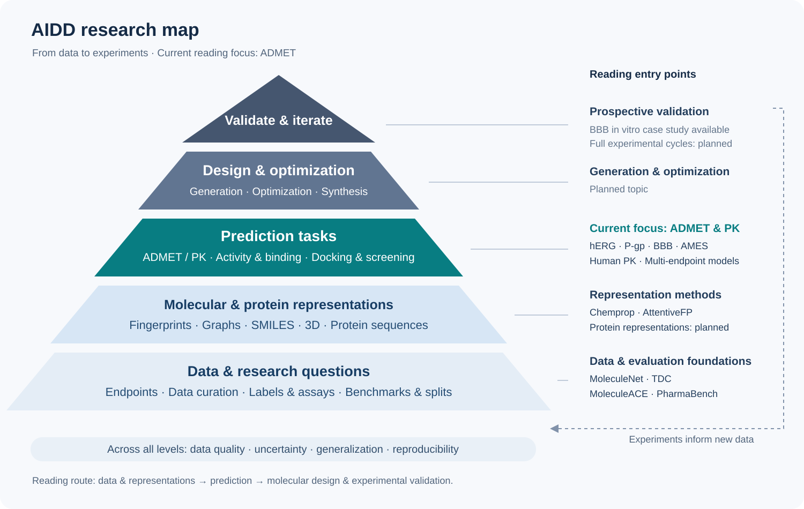

# ADMET Literature

**English** | [简体中文](README.zh-CN.md)

Research notes on **ADMET and pharmacokinetic prediction**, with representative papers, datasets and code. Each entry starts with a one-sentence summary and covers **publication venue and date, research problem, datasets, method and findings**. Papers on molecular representations and benchmarks provide the foundations.

The collection contains **33 papers**: **29 on ADMET and pharmacokinetics** and **4 on methods and benchmarks**, including 11 core readings. Publication types: 26 published research/data papers, 1 review, 1 perspective and 5 preprints. Most recent batch of source reviews: **2026-09-22**; each entry records its own sources and review date.

## AIDD knowledge map



Start with data and molecular representations, then explore property prediction, molecular design and experimental validation. ADMET is the main reading focus and an input to multiparameter optimization; experimental results feed back into data and models. [Explore the map and reading routes](en/docs/knowledge-map.md).

## Navigation

- [ADMET paper index](en/topics/admet.md): papers grouped by research role, with all five core fields.
- [Methods and benchmarks](en/topics/foundations.md): Chemprop, AttentiveFP, MoleculeNet and MoleculeACE.
- [Knowledge map](en/docs/knowledge-map.md): connect research questions, methods and reading routes.
- [Core reading](#core-reading): a starting point for research questions, data and methods.
- [Paper notes](#paper-notes): one-sentence summaries and all five fields for every paper, directly on this page.
- [Selection and curation](en/docs/curation.md): selection criteria, experimental comparisons and sources.
- [Research scope](en/docs/scope.md): current coverage and planned topics.
- [Contributing](en/CONTRIBUTING.md): recommend papers, correct metadata or add experimental details.
- [Shared catalog](data/papers.json) · [English translations](data/papers.en.json) · [English CSV](data/papers.en.csv).

| Topic | Coverage | Entry point |
| --- | --- | --- |
| ADMET and pharmacokinetics | 29 papers | [Paper index](en/topics/admet.md) |
| Methods and benchmarks | 4 papers on representations, data and evaluation | [Foundational reading](en/topics/foundations.md) |
| Other AIDD areas | Planned topics | [Research scope](en/docs/scope.md) |

## Core reading

| Paper | Journal/conference | Date | In one sentence |
| --- | --- | --- | --- |
| [ADMET reliability benchmark](en/papers/admet/admet-reliability-2026.md) | Journal of Cheminformatics | 2026-05-18 | Compares model families under limited data, unfamiliar molecular structures and class imbalance to assess ADMET prediction in practical research settings. |
| [CaliciBoost](en/papers/admet/caliciboost-2025.md) | Journal of Cheminformatics | 2025-12-22 | Combines molecular fingerprints, physicochemical descriptors and automated machine learning to predict permeability through the Caco-2 intestinal cell model. |
| [PKSmart](en/papers/admet/pksmart-2025.md) | Journal of Cheminformatics | 2025-09-26 | Predicts animal pharmacokinetic parameters, then combines them with molecular features to estimate human intravenous clearance, distribution volume and half-life. |
| [DCPM-ADMET](en/papers/admet/dcpm-admet-2026.md) | Journal of Cheminformatics | 2026-06-20 | Combines representations from two pretrained models with chemical fingerprints to predict 97 ADMET properties. |
| [KPGT](en/papers/admet/kpgt-2023.md) | Nature Communications | 2023-11-21 | Incorporates fingerprints and physicochemical descriptors into graph pretraining to learn representations for ADMET and other molecular properties. |
| [MolE](en/papers/admet/mole-2024.md) | Nature Communications | 2024-11-12 | Pretrains on a large collection of molecular graphs, adds supervised biological-task training, and fine-tunes for ADMET prediction. |
| [ADMET-AI](en/papers/admet/admet-ai-2024.md) | Bioinformatics | 2024-06-24 | Packages graph neural networks into web and local tools that predict multiple ADMET properties for large compound libraries. |
| [MTGL-ADMET](en/papers/admet/mtgl-admet-2023.md) | iScience | 2023-11 | Selects useful auxiliary tasks for each ADMET endpoint to reduce interference during multitask training. |
| [HERGAI](en/papers/admet/hergai-2025.md) | Journal of Cheminformatics | 2025-07-24 | Combines docking and ensemble models to identify compounds likely to block the cardiac hERG ion channel in large candidate collections. |
| [MC-PGP](en/papers/admet/mc-pgp-2025.md) | Journal of Pharmaceutical Analysis | 2025-08 | Fuses SMILES, fingerprints and molecular graphs to separately predict P-gp inhibition and transport-substrate status. |
| [AmesNet](en/papers/admet/amesnet-2026.md) | Chemical Research in Toxicology | 2026-06-29 | Combines molecular structure, bacterial strain and metabolic-activation conditions to improve Ames mutagenicity detection in unfamiliar chemical space. |

Suggested route: **practical evaluation → individual endpoints and human PK → representation learning and multitask methods → platforms**. Data benchmarks, reviews, perspectives and preprints have separate categories in the index.

## Reading and comparison

Compare **prediction tasks, data sources, train/test splits, metrics and baselines**. Detailed notes describe the experiments, findings and implications for further research. Historical leaderboard results include snapshot dates; preprints and published versions are identified separately.

## Paper notes

[Core papers](#core-papers) · [Further reading](#further-reading) · [Foundational methods](#foundational-methods) · [Data and benchmarks](#data-and-benchmarks) · [Reviews](#reviews) · [Perspectives](#perspectives) · [Preprints](#preprints)

Each entry below explains the research problem, method and main findings. Follow the detailed notes for experimental settings, analysis and references.

### Core papers

#### ADMET reliability benchmark

**Revisiting ADMET prediction reliability under real-world challenges in the foundation model era**

**In one sentence:** Compares model families under limited data, unfamiliar molecular structures and class imbalance to assess ADMET prediction in practical research settings.

| Field | Details |
| --- | --- |
| Publication and date | Journal of Cheminformatics 18, 95; 2026-05-18 |
| Research problem | Average benchmark scores miss reliability issues involving small datasets, out-of-distribution prediction, class imbalance, beyond-rule-of-five molecules and activity cliffs. |
| Datasets | 14 property/ADMET datasets covering hERG, BBBP, Caco-2, half-life, VDss, CYP and peptide properties, plus 30 bioactivity tasks from MoleculeACE. |
| Method | Compares KPGT, Uni-Mol, TabPFNv2, classical machine learning and AutoML in a common framework, using random, scaffold and Perimeter splits, resampling and ensembles. |
| Findings | TabPFNv2 often performs well in the evaluated small-data/OOD settings. Undersampling ensembles help with imbalance, while KPGT performs strongly on cyclic-peptide permeability with more training data. Activity cliffs remain difficult across models. |

[Paper](https://link.springer.com/article/10.1186/s13321-026-01217-2) · [Detailed notes](en/papers/admet/admet-reliability-2026.md) · [Code/project](https://github.com/DonghaiZHAO-ZJU/Benchmark-ADMET-2025)

#### CaliciBoost

**CaliciBoost: Performance-driven evaluation of molecular representations for caco-2 permeability prediction**

**In one sentence:** Combines molecular fingerprints, physicochemical descriptors and automated machine learning to predict permeability through the Caco-2 intestinal cell model.

| Field | Details |
| --- | --- |
| Publication and date | Journal of Cheminformatics 17, 184; 2025-12-22; preceded by a 2025 preprint. |
| Research problem | Caco-2 permeability data are limited and assay conditions vary, making it difficult to identify effective molecular features and modeling strategies. |
| Datasets | TDC Caco2_Wang contains 906 molecules. A separate OCHEM collection was reduced from 9,402 raw records to 5,481 modeling records through filtering and cleaning. The two datasets are modeled and evaluated separately. |
| Method | Compares fingerprints, RDKit/PaDEL/Mordred descriptors and CDDD representations, combining AutoGluon with feature selection, interpretation and hyperparameter optimization. |
| Findings | Feature selection and ensemble learning improve Caco-2 prediction. The official TDC Caco-2 leaderboard snapshot dated 2026-09-19 lists MAE = 0.256 ± 0.006 and ranks CaliciBoost first. |

[Paper](https://link.springer.com/article/10.1186/s13321-025-01137-7) · [Detailed notes](en/papers/admet/caliciboost-2025.md) · [Code/project](https://github.com/Calici/CaliciBoost)

#### PKSmart

**PKSmart: an open-source computational model to predict intravenous pharmacokinetics of small molecules**

**In one sentence:** Predicts animal pharmacokinetic parameters, then combines them with molecular features to estimate human intravenous clearance, distribution volume and half-life.

| Field | Details |
| --- | --- |
| Publication and date | Journal of Cheminformatics 17, 147; 2025-09-26 |
| Research problem | Human PK data are scarce, limiting structure-only models. The study examines how preclinical species information can improve human parameter prediction. |
| Datasets | Human intravenous PK data for 1,283 distinct compounds, covering VDss, clearance, half-life, unbound fraction and mean residence time; preclinical animal data for another collection of 371 compounds. Label availability varies by endpoint. |
| Method | First predicts rat, dog and monkey PK parameters from molecular features, then combines these predictions with molecular features in human random-forest models. Uses repeated nested cross-validation and external validation. |
| Findings | Reported external R² values are 0.39 for VDss and 0.46 for clearance, indicating that cross-species predictions can improve selected human PK endpoints. |

[Paper](https://link.springer.com/article/10.1186/s13321-025-01066-5) · [Detailed notes](en/papers/admet/pksmart-2025.md) · [Code/project](https://github.com/srijitseal/PKSmart)

#### DCPM-ADMET

**DCPM-ADMET: fusion of dual-component pre-trained model and molecular fingerprints to enhance drug ADMET properties prediction**

**In one sentence:** Combines representations from two pretrained models with chemical fingerprints to predict 97 ADMET properties.

| Field | Details |
| --- | --- |
| Publication and date | Journal of Cheminformatics 18, 126; 2026-06-20 |
| Research problem | A single representation struggles to capture semantic, structural and physicochemical information together, while ADMET labels are sparse and endpoints heterogeneous. |
| Datasets | Pretraining uses approximately 111 million PubChem records. The ADMET collection contains 97 endpoints: 43 regression and 54 classification tasks, with 465,470 endpoint records. Also evaluates 10 MoleculeNet datasets. |
| Method | Fuses XLNet semantic representations, a GRU component incorporating SMILES-to-InChI and property learning, and ECFP fingerprints; combines single-task random forests, multitask neural networks and parameter optimization. |
| Findings | Reports improvements over the ECFP baseline on 67/97 endpoints and the best results among compared methods on 5 of 10 MoleculeNet tasks. |

[Paper](https://link.springer.com/article/10.1186/s13321-026-01244-z) · [Detailed notes](en/papers/admet/dcpm-admet-2026.md) · [Code/project](https://github.com/zhangzhangleilei/DCPM-ADMET)

#### KPGT

**A knowledge-guided pre-training framework for improving molecular representation learning**

**In one sentence:** Incorporates fingerprints and physicochemical descriptors into graph pretraining to learn representations for ADMET and other molecular properties.

| Field | Details |
| --- | --- |
| Publication and date | Nature Communications 14, 7568; 2023-11-21. An earlier version appeared at KDD 2022; these notes cover the journal paper. |
| Research problem | Graph-pretraining objectives can diverge from downstream needs; representations must retain chemical knowledge and transfer effectively. |
| Datasets | Approximately 2 million ChEMBL29 molecules for pretraining; 63 downstream datasets comprising 11 common property datasets, 22 TDC ADMET tasks and 30 MoleculeACE tasks. |
| Method | Uses the LiGhT line-graph Transformer with descriptor- and fingerprint-guided pretraining, followed by downstream fine-tuning. |
| Findings | Figure 2c and Supplementary Table 8 report the best performance among the models compared at publication on 16/22 TDC ADMET tasks. |

[Paper](https://www.nature.com/articles/s41467-023-43214-1) · [Detailed notes](en/papers/admet/kpgt-2023.md) · [Code/project](https://github.com/lihan97/KPGT)

#### MolE

**MolE: a foundation model for molecular graphs using disentangled attention**

**In one sentence:** Pretrains on a large collection of molecular graphs, adds supervised biological-task training, and fine-tunes for ADMET prediction.

| Field | Details |
| --- | --- |
| Publication and date | Nature Communications 15, 9431; 2024-11-12. |
| Research problem | The study addresses how to learn transferable representations from very large unlabeled molecular collections and combine them with labeled biological information. |
| Datasets | Approximately 842 million molecular graphs from ZINC20 and ExCAPE-DB for self-supervised learning, followed by supervised multitask pretraining; ADMET evaluation covers 22 TDC tasks. |
| Method | Decoupled attention models atom content and relative graph position. Training proceeds from atom-environment prediction to supervised pretraining and downstream fine-tuning. |
| Findings | Reports results exceeding the best published methods in a September 2023 TDC snapshot on 10/22 tasks, with means and standard deviations across multiple runs. |

[Paper](https://www.nature.com/articles/s41467-024-53751-y) · [Detailed notes](en/papers/admet/mole-2024.md) · [Code/project](https://github.com/recursionpharma/mole_public)

#### ADMET-AI

**ADMET-AI: a machine learning ADMET platform for evaluation of large-scale chemical libraries**

**In one sentence:** Packages graph neural networks into web and local tools that predict multiple ADMET properties for large compound libraries.

| Field | Details |
| --- | --- |
| Publication and date | Bioinformatics 40(7), btae416; online 2024-06-24; July 2024 issue. |
| Research problem | Large-scale screening requires accurate multi-endpoint predictions, high throughput and local deployment. |
| Datasets | 41 TDC prediction tasks: 31 classification and 10 regression tasks. Performance rankings use the 22-task ADMET Benchmark Group subset. |
| Method | The paper uses Chemprop D-MPNN with 200 RDKit descriptors, separate multitask classification and regression models, and model ensembles. |
| Findings | At publication, the authors reported a leading average TDC ADMET rank and high batch-processing efficiency, with both web and local tools available. |

[Paper](https://pmc.ncbi.nlm.nih.gov/articles/PMC11226862/) · [Detailed notes](en/papers/admet/admet-ai-2024.md) · [Code/project](https://github.com/swansonk14/admet_ai)

#### MTGL-ADMET

**ADMET property prediction via multi-task graph learning under adaptive auxiliary task selection**

**In one sentence:** Selects useful auxiliary tasks for each ADMET endpoint to reduce interference during multitask training.

| Field | Details |
| --- | --- |
| Publication and date | iScience 26(11), 108285; November 2023 issue. Preceded by a RECOMB 2023 conference paper. |
| Research problem | Training all ADMET tasks together can cause negative transfer; each primary task may need a different auxiliary-task set. |
| Datasets | 24 endpoints collected from 8 publications: 18 classification and 6 regression tasks, covering 43,291 compounds and including ADMET plus 2 physicochemical endpoints. |
| Method | Uses state theory and maximum flow for auxiliary-task selection, together with shared atom representations, task-specific attention and a primary-task-centered gating module. |
| Findings | Comparisons and ablations show that adaptive task selection and gating improve prediction, supporting auxiliary-task selection tailored to the primary task. |

[Paper](https://pmc.ncbi.nlm.nih.gov/articles/PMC10654589/) · [Detailed notes](en/papers/admet/mtgl-admet-2023.md) · [Code/project](https://github.com/dubingxue/MTGL-ADMET)

#### HERGAI

**HERGAI: an artificial intelligence tool for structure-based prediction of hERG inhibitors**

**In one sentence:** Combines docking and ensemble models to identify compounds likely to block the cardiac hERG ion channel in large candidate collections.

| Field | Details |
| --- | --- |
| Publication and date | Journal of Cheminformatics 17, 110; 2025-07-24 |
| Research problem | Small or positive-enriched test sets poorly represent screening collections containing many negatives and few hERG blockers. |
| Datasets | 299,927 curated PubChem/ChEMBL molecules: 1,937 positives and 297,990 negatives. Uses an IC50 threshold of 20 μM and an approximately 3:1 train/test allocation grouped by Bemis–Murcko scaffold. |
| Method | Selects poses after Smina docking and extracts protein–ligand PLEC fingerprints. RF, XGBoost and DNN base models feed a DNN stacking model; oversampling occurs within training folds. |
| Findings | Reports test recall of approximately 86% for blockers with IC50 ≤ 20 μM and 94% for those with IC50 ≤ 1 μM. Screening enrichment exceeds the generic docking scores compared in the paper. |

[Paper](https://doi.org/10.1186/s13321-025-01063-8) · [Detailed notes](en/papers/admet/hergai-2025.md) · [Code/project](https://github.com/vktrannguyen/HERGAI)

#### MC-PGP

**A multimodal contrastive learning framework for predicting P-glycoprotein substrates and inhibitors**

**In one sentence:** Fuses SMILES, fingerprints and molecular graphs to separately predict P-gp inhibition and transport-substrate status.

| Field | Details |
| --- | --- |
| Publication and date | Journal of Pharmaceutical Analysis 15(8), 101313; August 2025 issue (PubMed article date: 2025-04-16). |
| Research problem | Single representations miss P-gp-related structural information. Inhibitors and substrates require distinct tasks and evaluation on compounds from new sources. |
| Datasets | Public databases/literature: 5,943 molecules for inhibition (4,558 positives, 1,385 negatives) and 4,018 for substrate prediction (2,455 positives, 1,563 negatives). Independent external sets contain 140 and 185 molecules, respectively. |
| Method | Attention fuses SMILES sequences, fingerprints and graphs. Graph contrastive learning aligns local and global structure, with analysis of relevant functional groups. |
| Findings | External inhibitor AUROC is 0.906 ± 0.015. The authors report relative AUROC improvements of 9.82%/10.62% over the next-best method on the inhibitor/substrate external sets. |

[Paper](https://doi.org/10.1016/j.jpha.2025.101313) · [Detailed notes](en/papers/admet/mc-pgp-2025.md)

#### AmesNet

**AmesNet: A Task-Conditioned Deep Learning Model with Enhanced Sensitivity and Generalization in Ames Mutagenicity Prediction**

**In one sentence:** Combines molecular structure, bacterial strain and metabolic-activation conditions to improve Ames mutagenicity detection in unfamiliar chemical space.

| Field | Details |
| --- | --- |
| Publication and date | Chemical Research in Toxicology; online 2026-06-29. |
| Research problem | Models miss mutagenic compounds outside the training domain, while increasing sensitivity alone can produce many false positives. |
| Datasets | Strain/S9-conditioned data compiled by Lui et al. After the published version's cleaning, training/validation contains 40,129 records and testing 4,208. Each record is a compound–strain–S9 combination. Foil data lacking strain/S9 information are evaluated separately. |
| Method | A molecular encoder and strain/±S9 condition channel form two branches. Compares single-task, ordinary/grouped multitask models and condition-augmented encoders including ChemProp and GROVER. |
| Findings | The published main OOD evaluation reports sensitivity 0.72 (95% CI 0.68–0.76) and balanced accuracy 0.81 (0.78–0.83). The supplementary Foil evaluation gives balanced accuracy 0.72. |

[Paper](https://doi.org/10.1021/acs.chemrestox.6c00082) · [Detailed notes](en/papers/admet/amesnet-2026.md) · [Code/project](https://github.com/Model-Medicines/TCL-Ames)

### Further reading

#### HimNet

**A hierarchical interaction message net for accurate molecular property prediction**

**In one sentence:** Exchanges information across atoms, substructures and whole molecules in a hierarchical graph network for property and selected ADMET predictions.

| Field | Details |
| --- | --- |
| Publication and date | Communications Chemistry 9, 150; 2026-02-14 |
| Research problem | Limited interaction across atom, substructure and molecular levels can leave property-relevant information out of single-level representations. |
| Datasets | 11 datasets: 8 MoleculeNet subsets plus Malaria, LMC and MetStab. BBBP, Tox21, SIDER, ClinTox and metabolic-stability tasks directly concern ADMET; others assess broader properties or bioactivity. |
| Method | Hierarchical message passing and attention combine directed message paths, cross-level interactions and consistency information from multiple fingerprints. |
| Findings | Tables 1–2 report best or near-best results on several tasks among the compared methods, supporting hierarchical feature fusion. |

[Paper](https://www.nature.com/articles/s42004-026-01922-x) · [Detailed notes](en/papers/admet/himnet-2026.md)

#### MolMCL

**Multi-channel learning for integrating structural hierarchies into context-dependent molecular representation**

**In one sentence:** Learns molecular, scaffold and local-context representations, then combines them by task for property and bioactivity prediction.

| Field | Details |
| --- | --- |
| Publication and date | Nature Communications 16, 413; 2025-01-06. The DOI contains 2024; publication was in 2025. |
| Research problem | Tasks depend on different structural levels, making fixed graph representations and readouts difficult to adapt across tasks. |
| Datasets | ZINC15 for pretraining; 7 MoleculeNet datasets and 30 MoleculeACE bioactivity tasks for downstream evaluation. |
| Method | Multichannel learning over molecular, scaffold and contextual information, using molecular perturbations, contrastive learning and prompt-guided readout. |
| Findings | Multichannel learning and task adaptation improve representations on the evaluated molecular tasks, with activity-cliff experiments demonstrating the design's value. |

[Paper](https://www.nature.com/articles/s41467-024-55082-4) · [Detailed notes](en/papers/admet/molmcl-2025.md) · [Code/project](https://github.com/yuewan2/MolMCL)

#### ADMETlab 3.0

**ADMETlab 3.0: an updated comprehensive online ADMET prediction platform enhanced with broader coverage, improved performance, API functionality and decision support**

**In one sentence:** Provides online ADMET and physicochemical predictions with uncertainty estimates, an API and decision-support tools.

| Field | Details |
| --- | --- |
| Publication and date | Nucleic Acids Research 52(W1), W422–W431; online 2024-04-04; July 2024 issue. |
| Research problem | Limited property coverage, inconvenient access and point predictions alone constrain platform support for compound selection. |
| Datasets | More than 400,000 records support model development; the platform provides 119 property/assessment outputs, including predicted endpoints and calculated properties. |
| Method | Multitask directed message passing and descriptor-based modeling, combined with predictive uncertainty, API access and decision support. |
| Findings | Expands property coverage and integrates batch processing, API access and uncertainty estimation for ADMET screening. |

[Paper](https://doi.org/10.1093/nar/gkae236) · [Detailed notes](en/papers/admet/admetlab-3-2024.md)

#### admetSAR3.0

**admetSAR3.0: a comprehensive platform for exploration, prediction and optimization of chemical ADMET properties**

**In one sentence:** Integrates ADMET data search, property prediction and structural optimization suggestions to help identify suitable candidates.

| Field | Details |
| --- | --- |
| Publication and date | Nucleic Acids Research 52(W1), W432–W438; online 2024-04-22; July 2024 issue. |
| Research problem | Users need both property predictions and ways to find similar compounds and structural modifications that improve ADMET. |
| Datasets | More than 370,000 experimental records covering 104,652 distinct compounds and 119 ADMET endpoints. |
| Method | Multitask graph neural networks with database retrieval, similarity search, structural transformations and scaffold-hopping tools. |
| Findings | Combines molecular exploration, property prediction and optimization suggestions in one platform for multiparameter screening and design. |

[Paper](https://doi.org/10.1093/nar/gkae298) · [Detailed notes](en/papers/admet/admetsar-3-2024.md)

#### CardioTox net

**CardioTox net: a robust predictor for hERG channel blockade based on deep learning meta-feature ensembles**

**In one sentence:** Combines neural-network predictions from different molecular representations to identify hERG blockers and tests them on three external datasets.

| Field | Details |
| --- | --- |
| Publication and date | Journal of Cheminformatics 13, 60; 2021-08-16 |
| Research problem | Single representations can omit relevant information, while simple model combinations struggle to balance sensitivity, specificity and predictive accuracy. |
| Datasets | 12,620 training molecules from BindingDB, ChEMBL and literature: 6,643 blockers and 5,977 non-blockers. Three external sets contain 44, 41 and 839 molecules, using an IC50 threshold of 10 μM. |
| Method | Five base neural networks process different chemical features; a separate neural network combines their predictions. A 70/10/10/10 allocation supports base-model training/validation and meta-model training/validation. |
| Findings | External MCC values are 0.599/0.452/0.220 and accuracies 0.810/0.755/0.746. Several metrics improve over selected earlier methods, but PPV on the third, imbalanced set is only 0.113. |

[Paper](https://doi.org/10.1186/s13321-021-00541-z) · [Detailed notes](en/papers/admet/cardiotox-net-2021.md) · [Code/project](https://github.com/Abdulk084/CardioTox)

#### BBB MegaMolBART

**Predicting blood–brain barrier permeability of molecules with a large language model and machine learning**

**In one sentence:** Predicts blood–brain barrier permeability with a molecular language model and XGBoost, then tests selected compounds in human-derived 3D BBB spheroids.

| Field | Details |
| --- | --- |
| Publication and date | Scientific Reports 14, 15844; 2024-07-09 |
| Research problem | BBB labels are limited; the study tests whether pretrained molecular representations improve prediction and receive experimental support in vitro. |
| Datasets | B3DB: 7,807 molecules (4,956 BBB+, 2,851 BBB−); CMUH: 2,499 (105 BBB+, 2,394 BBB−). B3DB includes 1,058 logBB values. Spheroid experiments select 21 predicted permeable and 5 predicted impermeable candidates, with controls. |
| Method | MegaMolBART encodes SMILES for XGBoost classification/regression, compared with Morgan fingerprints. BBB spheroids contain human brain microvascular endothelial cells, pericytes and astrocytes; LC–MS/MS measures permeability. |
| Findings | Reports a final held-out AUROC of 0.88. Spheroid results agree with prediction directions for the selected candidates, supporting exploratory BBB screening. |

[Paper](https://doi.org/10.1038/s41598-024-66897-y) · [Detailed notes](en/papers/admet/bbb-megamolbart-2024.md)

#### AMES multitask DNN

**Multitask Deep Neural Networks for Ames Mutagenicity Prediction**

**In one sentence:** Learns Ames outcomes for five bacterial strains jointly, retaining strain-specific information alongside the overall mutagenicity label.

| Field | Details |
| --- | --- |
| Publication and date | Journal of Chemical Information and Modeling 62(24), 6342–6351; online 2022-09-06. |
| Research problem | Collapsing results across strains into one label discards strain-level information useful for mutagenicity prediction. |
| Datasets | Authors' Mendeley v2 data: 5,536 ISSSTY-curated molecules with 1,360 Mordred descriptors, labels for TA98, TA100, TA102, TA1535 and TA1537 plus Overall, including undetermined labels. Train/Internal/External partitions are provided. |
| Method | A shared-representation multitask DNN learns five strain outcomes and is compared with overall-label single-task models, strain-specific models and their ensembles. Compounds with partially undetermined labels are retained. |
| Findings | The published abstract reports improvements over overall-label single-task models and ensembles of strain-specific models, supporting the use of strain-level information. |

[Paper](https://doi.org/10.1021/acs.jcim.2c00532) · [Detailed notes](en/papers/admet/ames-multitask-2022.md) · [Code/project](https://github.com/VirSabando/MTL_DNN_Ames)

#### SSL-GCN

**Chemical toxicity prediction based on semi-supervised learning and graph convolutional neural network**

**In one sentence:** Trains a graph neural network on labeled and unlabeled molecules to improve Tox21 toxicity prediction through semi-supervised learning.

| Field | Details |
| --- | --- |
| Publication and date | Journal of Cheminformatics 13, 93; 2021-11-27 |
| Research problem | Toxicity labels are limited, while many compounds have only structural information; supervised graph models cannot fully use these unlabeled molecules. |
| Datasets | Tox21: 7,831 molecules and 12 toxicity endpoints. Removing labels from ClinTox, SIDER, ToxCast and HIV and excluding structures overlapping with Tox21 yields 50,527 unlabeled molecules. |
| Method | A GCN encodes molecular graphs within a Mean Teacher framework. The student learns toxicity labels, teacher parameters follow an exponential moving average of student parameters, and prediction consistency under perturbations incorporates unlabeled data. |
| Findings | The paper reports a best mean ROC-AUC of 0.757, compared with about 0.71 for the conventional machine-learning models evaluated. Unlabeled data improve prediction, with the best mixing ratio varying by endpoint. |

[Paper](https://link.springer.com/article/10.1186/s13321-021-00570-8) · [Detailed notes](en/papers/admet/ssl-gcn-2021.md) · [Code/project](https://github.com/chen709847237/SSL-GCN)

#### Domain-aware / pBRICS

**Domain-aware representation of small molecules for explainable property prediction models**

**In one sentence:** Builds chemically meaningful molecular fragments so graph models can predict ADMET properties and identify fragments contributing to each prediction.

| Field | Details |
| --- | --- |
| Publication and date | ICLR 2023 Machine Learning for Drug Discovery (MLDD) Workshop; 2023 |
| Research problem | Atom-level importance is difficult to translate into functional groups and medicinal-chemistry changes, while generic fragmentation can break chemically meaningful substructures. |
| Datasets | 23 classification endpoints curated from ADMETlab 2.0 data, covering Ames mutagenicity, carcinogenicity, CYPs, eye and respiratory toxicity, BBBP and Tox21. ChEMBL molecules support fragmentation analysis; interpretation cases include 102 BBBP matched molecular pairs comprising 110 unique molecules. |
| Method | pBRICS post-processes BRICS fragments using functional-group rules to organize scaffolds and substituents. MACCS and ECFP2 fragment fingerprints feed single-task and multitask GCN/RGCN models; Grad-CAM and matched molecular pairs examine fragment contributions. |
| Findings | In Table 2, multitask fragment RGCN achieves mean AUROC of 84.47% across 23 endpoints, versus 83.35% for the comparator trained with ADMETlab 2.0 code, a gain of 1.12 percentage points. Fragment analyses connect functional-group changes with BBBP and Ames predictions. |

[Paper](https://openreview.net/forum?id=C9WW17wQF7p) · [Detailed notes](en/papers/admet/domain-aware-pbrics-2023.md)

### Foundational methods

#### Chemprop / D-MPNN

**Analyzing Learned Molecular Representations for Property Prediction**

**In one sentence:** Learns molecular representations by passing messages along directed chemical bonds and evaluates property prediction on public and industrial data.

| Field | Details |
| --- | --- |
| Publication and date | Journal of Chemical Information and Modeling 59(8), 3370–3388; 2019-07-30 |
| Research problem | Evidence was limited on whether learned representations outperform handcrafted descriptors and generalize to industrial data and new chemical space. |
| Datasets | 19 public and 16 private industrial datasets spanning multiple chemical endpoints. |
| Method | Directed-bond message passing (D-MPNN), molecular-level computed features and hyperparameter optimization, compared with fixed descriptors and earlier graph networks. |
| Findings | Matches or exceeds several baselines on the evaluated public/industrial tasks, demonstrating the practical value of learned representations. Performance remains below experimental reproducibility and varies by task and split. |

[Paper](https://doi.org/10.1021/acs.jcim.9b00237) · [Detailed notes](en/papers/foundations/chemprop-dmpnn-2019.md) · [Code/project](https://github.com/chemprop/chemprop)

#### AttentiveFP

**Pushing the Boundaries of Molecular Representation for Drug Discovery with the Graph Attention Mechanism**

**In one sentence:** Learns which atoms and neighborhoods to emphasize when aggregating molecular information for property prediction and structural attribution.

| Field | Details |
| --- | --- |
| Publication and date | Journal of Medicinal Chemistry 63(16), 8749–8760; online in 2019; issue date 2020-08-27. |
| Research problem | Representations must capture local and longer-range structural relationships while making model-selected chemical features easier to inspect. |
| Datasets | The authors' repository provides BBBP, HIV, BACE, ClinTox, SIDER, Tox21, ToxCast, ESOL (delaney), FreeSolv (SAMPL), Lipophilicity, QM9 and aromaticity examples, covering ADMET, activity, physicochemical and quantum-chemical tasks. |
| Method | Attention in molecular-graph message aggregation and graph-level readout produces learned fingerprints; attention visualization explores structural information. |
| Findings | Reports advanced performance at publication on the tested tasks and visual examples of learned nonlocal intramolecular relationships. |

[Paper](https://doi.org/10.1021/acs.jmedchem.9b00959) · [Detailed notes](en/papers/foundations/attentivefp-2019.md) · [Code/project](https://github.com/OpenDrugAI/AttentiveFP)

### Data and benchmarks

#### TDC

**Therapeutics Data Commons: Machine Learning Datasets and Tasks for Drug Discovery and Development**

**In one sentence:** Organizes drug-discovery datasets and tasks into shared interfaces and benchmarks for consistent model comparison.

| Field | Details |
| --- | --- |
| Publication and date | NeurIPS 2021 Datasets and Benchmarks Track. The related 2022 Nature Chemical Biology paper is a separate publication. |
| Research problem | Fragmented datasets, task interfaces, splits and evaluation protocols make fair comparisons difficult. |
| Datasets | A collection spanning drug discovery and development. These notes focus on its 22-task ADMET Benchmark Group; the conference paper covers a broader set of tasks. |
| Method | Defines tasks, data interfaces, standardized benchmarks and public leaderboards. |
| Findings | Provides data loading, task splits and evaluation tools for comparing drug-discovery models under common settings. |

[Paper](https://datasets-benchmarks-proceedings.neurips.cc/paper/2021/hash/3948ead63a9f2944218de038d8930b8f-Abstract-round2.html) · [Detailed notes](en/papers/admet/tdc-2021.md)

#### PharmaBench

**PharmaBench: Enhancing ADMET benchmarks with large language models**

**In one sentence:** Uses language models to extract assay conditions, then cleans and harmonizes ADMET records to build better-specified benchmarks.

| Field | Details |
| --- | --- |
| Publication and date | Scientific Data 11, 985; 2024-09-10 |
| Research problem | Inconsistent assay conditions and endpoint definitions reduce benchmark quality when labels are simply pooled. |
| Datasets | 156,618 raw records from 14,401 bioassays, curated into 52,482 records across 11 ADMET datasets. |
| Method | Language-model-assisted assay-information extraction, followed by curation of structures, units, duplicates and assay conditions, with modeling splits provided. |
| Findings | Harmonizes assay conditions and data processing to provide ADMET modeling datasets with clearer experimental context. |

[Paper](https://www.nature.com/articles/s41597-024-03793-0) · [Detailed notes](en/papers/admet/pharmabench-2024.md) · [Code/project](https://github.com/mindrank-ai/PharmaBench)

#### MoleculeNet

**MoleculeNet: a benchmark for molecular machine learning**

**In one sentence:** Brings molecular datasets, splits, metrics and algorithms into a shared benchmark for property prediction.

| Field | Details |
| --- | --- |
| Publication and date | Chemical Science 9(2), 513–530 (2018 issue); online 2017-10-31. |
| Research problem | Different choices of datasets, metrics and implementations make model improvements difficult to separate from evaluation effects. |
| Datasets | Public quantum-chemical, physicochemical, biophysical and physiological datasets, including ESOL, FreeSolv, Lipophilicity, BBBP, Tox21, ClinTox, SIDER, BACE, HIV and QM collections, with task-specific metrics and splits. |
| Method | DeepChem data loaders, molecular featurizers and learning algorithms support systematic comparisons of fixed descriptors and learned representations. |
| Findings | Learned representations work across multiple tasks, while small datasets and imbalance remain challenging. Physically informed features can matter more than algorithm choice in quantum/biophysical tasks. |

[Paper](https://doi.org/10.1039/C7SC02664A) · [Detailed notes](en/papers/foundations/moleculenet-2018.md) · [Code/project](https://github.com/deepchem/deepchem)

#### MoleculeACE

**Exposing the Limitations of Molecular Machine Learning with Activity Cliffs**

**In one sentence:** Evaluates structurally similar molecules with large activity differences to expose model weaknesses hidden by average prediction errors.

| Field | Details |
| --- | --- |
| Publication and date | Journal of Chemical Information and Modeling 62(23), 5938–5951; 2022-12-01; with a 2023 correction. |
| Research problem | Overall error does not adequately capture activity-cliff performance, which matters for lead optimization. |
| Datasets | Curated bioactivity datasets for 30 macromolecular targets, comparing 24 machine-learning strategies. The authors provide data and evaluation workflows. |
| Method | Defines structurally similar pairs with large activity differences and reports overall RMSE alongside cliff-molecule RMSEcliff, comparing descriptor models with graph/sequence neural networks. |
| Findings | Several descriptor-based methods outperform more complex deep models in the tested activity-cliff settings. Performance varies by target, supporting separate cliff metrics. |

[Paper](https://doi.org/10.1021/acs.jcim.2c01073) · [Detailed notes](en/papers/foundations/moleculeace-2022.md) · [Code/project](https://github.com/molML/MoleculeACE)

### Reviews

#### AI for drug toxicity: review

**Artificial Intelligence in Drug Toxicity Prediction: Recent Advances, Challenges, and Future Perspectives**

**In one sentence:** Surveys machine-learning and deep-learning approaches by toxicity task and collects public datasets and prediction tools for model development.

| Field | Details |
| --- | --- |
| Publication and date | Journal of Chemical Information and Modeling 63(9), 2628–2643; online 2023-04-26 |
| Research problem | Toxicity research spans heterogeneous endpoints, data resources and models, creating a need for task-oriented routes to usable datasets, representative methods and tools. |
| Datasets | Covers six major toxicity properties and Tox21 endpoints. Supplementary Table S2 lists resources including Tox21, TOXRIC, ToxRefDB 2.0, DILIrank, ToxCast, CTD, PubChem, ChEMBL, OCHEM and TDC; database sizes are recorded as accessed on 2022-05-10. |
| Method | Reviews machine-learning algorithms and deep-learning architectures for toxicity prediction. Supplementary Table S1 compares Tox21 methods, input features and performance; S2 lists data sources; S3 catalogs tools, their model counts and algorithms. |
| Findings | Provides a task-oriented route to models, data and tools, covering fingerprint and descriptor models as well as graph networks, multitask and knowledge-guided methods. It offers a reading framework for a toxicity-prediction topic. |

[Paper](https://pubs.acs.org/doi/10.1021/acs.jcim.3c00200) · [Detailed notes](en/papers/admet/ai-toxicity-review-2023.md)

### Perspectives

#### OpenADMET / Avoid-ome

**Mapping the avoid-ome: a systematic open-science approach to predictive ADMET**

**In one sentence:** Proposes combining open experimental data, protein structures, active learning and blind challenges to improve mechanistic ADMET prediction.

| Field | Details |
| --- | --- |
| Publication and date | Nature Communications 17, 4644; 2026-05-25; Perspective. |
| Research problem | Public ADMET data are scarce and assays inconsistent; limited structural mechanistic information constrains model-guided optimization. |
| Datasets | Discusses open, mechanism-oriented data generation and experimental plans involving CYPs, transporters, PXR and hERG. |
| Method | Connects high-throughput chemistry, functional assays, structural biology, active learning and blind challenges to study ADMET-related anti-targets. |
| Findings | Outlines a research program using open experimental data and mechanistic modeling to support multiparameter drug design. |

[Paper](https://www.nature.com/articles/s41467-026-73410-8) · [Detailed notes](en/papers/admet/openadmet-avoidome-2026.md) · [Code/project](https://github.com/OpenADMET)

### Preprints

#### MapLight

**ADMET property prediction through combinations of molecular fingerprints**

**In one sentence:** Combines molecular fingerprints and descriptors in CatBoost models to assess the strength of conventional features for ADMET prediction.

| Field | Details |
| --- | --- |
| Publication and date | arXiv preprint, initially submitted 2023-09-29; these notes cover that version. |
| Research problem | Can simple, computationally inexpensive feature-based models remain competitive with deep learning? |
| Datasets | 22 TDC ADMET tasks. |
| Method | Combines ECFP, Avalon, ErG and molecular descriptors in CatBoost, with an additional variant incorporating GNN representations. |
| Findings | Fingerprint combinations perform well on multiple ADMET endpoints and provide useful baselines. A subsequent third-party audit reports that two MapLight variants passed its checks. |

[Paper](https://arxiv.org/abs/2310.00174) · [Detailed notes](en/papers/admet/maplight-2023.md) · [Code/project](https://github.com/maplightrx/MapLight-TDC)

#### TDC model audit

**Critical Assessment of ML models for ADMET Prediction in TDC leaderboards**

**In one sentence:** Checks whether leading TDC models run, contain data leakage and reproduce their reported ADMET results.

| Field | Details |
| --- | --- |
| Publication and date | bioRxiv preprint, 2026; Crossref publication date 2026-02-28; the DOI contains 02-26. |
| Research problem | Leaderboard results may depend on pretraining leakage, validation/test overlap or environment problems that affect reproducibility. |
| Datasets | 10 leading methods selected from the 22-task TDC ADMET benchmark, using the audit's leaderboard snapshot and code versions. |
| Method | Sequentially checks environment availability, pretraining leakage, validation/test overlap and result reproduction. |
| Findings | The authors report that only MapLight, MapLight+GNN and CaliciBoost pass all checks. CaliciBoost addresses Caco-2 specifically, rather than all 22 tasks. |

[Paper](https://www.biorxiv.org/content/10.64898/2026.02.26.708193v1) · [Detailed notes](en/papers/admet/tdc-audit-2026.md) · [Code/project](https://github.com/receptor-ai/tdc-admet-bench)

#### Trimole-Hybrid

**A multimodal representation learning platform for accurate molecular ADMET prediction**

**In one sentence:** Fuses sequences, molecular graphs, 3D structures and chemical priors, selecting prediction models or ensembles for each ADMET task.

| Field | Details |
| --- | --- |
| Publication and date | bioRxiv preprint; Crossref publication date 2026-08-25; the DOI contains 08-24. The author repository labels it under review. |
| Research problem | A single representation may not suit all endpoints; complementary modalities must be combined with a controlled model-selection process. |
| Datasets | 22 TDC ADMET tasks. |
| Method | Combines SMILES, molecular graphs, 3D geometry and chemical priors with task-specific prediction heads, model selection and ensembles. |
| Findings | Reports scores above the top entry on 10/22 tasks and within the top ten on 21/22 tasks in the selected public leaderboard snapshot. |

[Paper](https://www.biorxiv.org/content/10.64898/2026.08.24.746660v1) · [Detailed notes](en/papers/admet/trimole-hybrid-2026.md) · [Code/project](https://github.com/dchen0212/trimole_hybrid)

#### ADMET-EvO

**ADMET-EvO: a self-evolving scientific agent for sustained research across heterogeneous tasks**

**In one sentence:** Uses a research agent to explore features and models for ADMET tasks, evaluating prediction and research efficiency through a fixed testing workflow.

| Field | Details |
| --- | --- |
| Publication and date | arXiv preprint, initially submitted 2026-09-09; updated to v2 on 2026-09-10. |
| Research problem | Different endpoints need different features, models and optimization strategies, making repeated manual exploration costly. Automated research also needs test-independent model selection. |
| Datasets | 22 TDC ADMET tasks plus 43 toxicity tasks. |
| Method | An evidence-gated research agent explores hypotheses, features and models. The paper describes freezing the workflow before held-out testing and validation over multiple seeds. |
| Findings | Reports a task-normalized aggregate score of 96.77 and reduced cumulative model-fitting time under the stated comparisons and resource constraints. |

[Paper](https://arxiv.org/abs/2609.10121) · [Detailed notes](en/papers/admet/admet-evo-2026.md)

#### Uni-QSAR

**Uni-QSAR: an Auto-ML Tool for Molecular Property Prediction**

**In one sentence:** Automatically combines fingerprints, descriptors and pretrained 1D, 2D and 3D molecular representations with tuning and stacked ensembles for ADMET prediction.

| Field | Details |
| --- | --- |
| Publication and date | arXiv:2304.12239, v1; 2023-04-24 |
| Research problem | Different properties favor different molecular features, making manual representation, model and hyperparameter selection costly; skewed regression labels and class imbalance add further modeling challenges. |
| Datasets | The 22 TDC ADMET Benchmark Group tasks: nine regression and 13 classification tasks. A separate CNS penetration case uses 940 training compounds (315 positive and 625 negative) and 117 external test compounds. |
| Method | Combines fingerprints and descriptors with 1D representations such as K-BERT, 2D representations including GROVER, MolCLR and KPGT, and Uni-Mol 3D representations. Target transformations, imbalance-aware learning, Bayesian optimization and two-level stacking are orchestrated with dflow. |
| Findings | Tables 1–2 report Caco-2 MAE of 0.273 and BBBP AUROC of 0.925. Counting the printed TDC ranking rows gives 17 first-place results across 22 tasks. The CNS case reports AUROC of 0.980; ablations support the contributions of 3D representations, stacking and target transformations. |

[Paper](https://arxiv.org/abs/2304.12239) · [Detailed notes](en/papers/admet/uni-qsar-2023.md) · [Code/project](https://github.com/deepmodeling/unimol_tools)

## Data and maintenance

`data/papers.json` holds shared metadata and Chinese notes; `data/papers.en.json` holds English translations linked by paper ID. Both versions are generated together with Python 3.10+ and no third-party dependencies:

```bash
python scripts/build.py
python scripts/build.py --check
```

The build updates both homepages, topic indexes, paper notes and CSV exports. Checks cover required fields, duplicate records, dates, URLs, local links, translation coverage, source synchronization and generated-file consistency. See [Contributing](en/CONTRIBUTING.md) for the translation workflow.

## References and acknowledgments

The organization draws on topic navigation in [awesome-AIDD](https://github.com/daiyun02211/awesome-AIDD), paper/code indexing in [Awesome-Deepfakes-Detection](https://github.com/Daisy-Zhang/Awesome-Deepfakes-Detection), and the open-data and evaluation work of [OpenADMET](https://github.com/OpenADMET).

Original notes and maintenance scripts use the [MIT License](LICENSE). Referenced papers, datasets and third-party code retain their own licenses; this repository provides links and original summaries.
