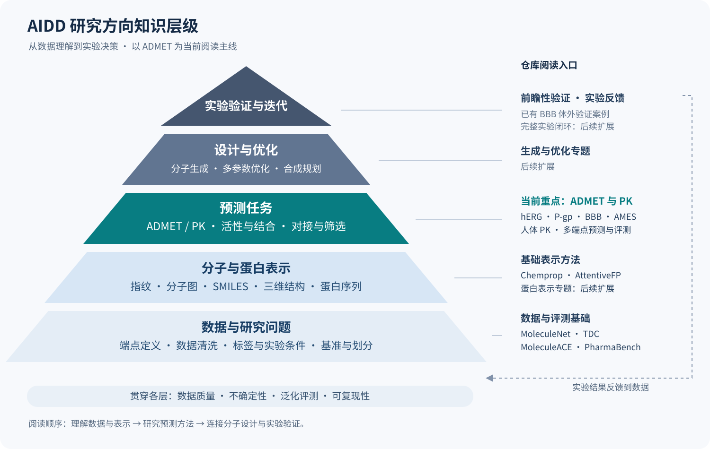

# ADMET 文献整理

[English](README.md) | **简体中文**

ADMET literature notes, with supporting methods and benchmarks for AI-aided drug discovery.

梳理 **ADMET 与药代动力学预测** 的研究进展，整理代表论文、数据集与代码资源。每篇先简要介绍研究内容，再展开 **发表期刊/会议与时间、主要痛点、数据集、方法和结论**。分子表示与基准文献提供相关基础知识。

目前收录 **35 篇**：**31 篇 ADMET 与药代动力学**、**4 篇基础方法与基准**，其中 11 篇列为核心精读。正式研究与数据论文 28 篇、综述 1 篇、观点文章 1 篇、预印本 5 篇。最近一批资料核对日期：**2026-09-22**；各篇记录具体来源和核对日期。

## AIDD 知识地图



从数据和分子表示出发，逐步了解性质预测、分子设计与实验验证。ADMET 是当前阅读主线，也是多参数优化的重要依据；实验结果再反馈到数据与模型。[查看各层说明与阅读路线](docs/knowledge-map.md)。

## 导航

- [ADMET 论文总表](topics/admet.md)：按发表时间从新到旧排列，逐篇保留五项核心信息。
- [方法对比](docs/comparison.md)：按端点查看同一 TDC 基准下的成绩，附交互表与 CSV。
- [数据集字典](docs/datasets.md)：数据规模、端点、来源、许可与加载入口。
- [基础方法与基准](topics/foundations.md)：Chemprop、AttentiveFP、MoleculeNet、MoleculeACE。
- [知识地图说明](docs/knowledge-map.md)：从研究问题找到方法、任务和阅读入口。
- [优先精读](#优先精读)：先建立研究问题、数据和方法的认识。
- [论文梳理](#论文梳理)：直接在本页查看全部 35 篇的内容概述、发表信息、痛点、数据集、方法和结论。
- [选文与整理方法](docs/curation.md)：选文标准、实验比较和资料来源。
- [AIDD 研究范围](docs/scope.md)：当前覆盖与后续专题。
- [讨论区](https://github.com/MasterDGL/admet-literature/discussions)：提问与推荐论文。
- [维护说明](docs/maintenance.md)：自动检查、链接巡检和数据更新。
- [贡献方式](CONTRIBUTING.md)：推荐论文、纠正信息或补充实验依据。
- [结构化数据](data/papers.json) · [CSV 总表](data/papers.csv)。

| 专题 | 当前内容 | 入口 |
| --- | --- | --- |
| ADMET 与药代动力学 | 31 篇 | [论文总表](topics/admet.md) |
| 基础方法与基准 | 4 篇；分子表示、数据与评测 | [基础阅读](topics/foundations.md) |
| 其他 AIDD 方向 | 扩展计划，尚未纳入独立专题 | [研究范围](docs/scope.md) |

## 优先精读

| 论文 | 期刊/会议 | 发表时间 | 内容概述 |
| --- | --- | --- | --- |
| [AmesNet](papers/admet/amesnet-2026.md) | Chemical Research in Toxicology | 2026-06-29 | 将分子结构、菌株与代谢活化条件一起输入模型，提高陌生化学结构的 Ames 致突变性识别能力。 |
| [DCPM-ADMET](papers/admet/dcpm-admet-2026.md) | Journal of Cheminformatics | 2026-06-20 | 将两种预训练模型学到的分子表示与化学指纹结合，用于预测 97 项 ADMET 性质。 |
| [ADMET可靠性评测](papers/admet/admet-reliability-2026.md) | Journal of Cheminformatics | 2026-05-18 | 在小样本、陌生分子结构和类别不均衡等条件下比较多类模型，检验 ADMET 预测在实际研究中是否可靠。 |
| [CaliciBoost](papers/admet/caliciboost-2025.md) | Journal of Cheminformatics | 2025-12-22 | 比较分子指纹和理化描述符，结合自动机器学习预测分子通过肠道细胞模型（Caco-2）的能力。 |
| [PKSmart](papers/admet/pksmart-2025.md) | Journal of Cheminformatics | 2025-09-26 | 先预测动物体内的药代参数，再结合分子结构预测人体静脉给药后的清除率、分布容积和半衰期等指标。 |
| [MC-PGP](papers/admet/mc-pgp-2025.md) | Journal of Pharmaceutical Analysis | 2025-08 | 融合 SMILES、指纹和分子图，分别判断分子是否抑制 P-gp、是否会被 P-gp 转运。 |
| [HERGAI](papers/admet/hergai-2025.md) | Journal of Cheminformatics | 2025-07-24 | 结合分子对接与集成模型，从大量候选分子中识别可能阻断 hERG 心脏离子通道的化合物。 |
| [MolE](papers/admet/mole-2024.md) | Nature Communications | 2024-11-12 | 先在海量分子图上预训练，再利用生物学任务数据进一步训练，最后用于 ADMET 性质预测。 |
| [ADMET-AI](papers/admet/admet-ai-2024.md) | Bioinformatics | 2024-06-24 | 将图神经网络用于网页和本地预测工具，一次预测多项 ADMET 性质，方便快速筛选大规模化合物库。 |
| [KPGT](papers/admet/kpgt-2023.md) | Nature Communications | 2023-11-21 | 把分子指纹和理化描述符融入图预训练，让模型学到更适合预测 ADMET 等性质的分子表示。 |
| [MTGL-ADMET](papers/admet/mtgl-admet-2023.md) | iScience | 2023-11 | 为每个 ADMET 预测任务自动挑选有帮助的辅助任务，减少多任务联合训练时的相互干扰。 |

建议顺序：**真实场景评测 → 单端点与人体 PK → 表示学习与多任务方法 → 平台应用**。专题总表按发表时间倒序排列，并标注研究分类，方便按阅读目的查找。

## 阅读与比较

比较模型时，重点看 **预测任务、数据来源、训练/测试划分、指标和对照方法**。单篇解读会列出这些实验设置，说明结果及其对后续研究的启发。历史榜单成绩附查询日期，预印本与正式发表版本分别标注。

## 论文梳理

[2026](#2026) · [2025](#2025) · [2024](#2024) · [2023](#2023) · [2022](#2022) · [2021](#2021) · [2020](#2020) · [2019](#2019) · [2017](#2017)

下列论文按发表时间从新到旧排列，介绍每篇的研究问题、方法与主要发现；实验设置、结果分析和参考资料见详细解读。

### 2026

#### ADMET-EvO

**ADMET-EvO: a self-evolving scientific agent for sustained research across heterogeneous tasks**

发表时间：**2026-09-09** · 🟠 **预印本** · 分类：预印本。

**内容概述：** 让研究智能体针对不同 ADMET 任务探索特征和模型，并通过固定测试流程评价预测效果与研究效率。

| 字段 | 内容 |
| --- | --- |
| 发表期刊/会议与时间 | arXiv 预印本，2026-09-09 首次提交，2026-09-10 更新 v2。 |
| 主要痛点 | 不同端点需要不同特征、模型和优化过程，人工反复探索成本高；自动研究还需避免使用测试集指导选择。 |
| 数据集 | TDC ADMET 22 任务，另包含 43 个毒性任务。 |
| 方法 | 使用有证据门槛的研究智能体进行假设、特征与模型探索；论文描述冻结方案后进行留出测试评价及多随机种子验证。 |
| 结论 | 作者报告任务归一化综合得分 96.77，并在其指定比较和约束下减少累计模型拟合时间。 |

[论文原文](https://arxiv.org/abs/2609.10121) · [详细解读](papers/admet/admet-evo-2026.md)

#### Trimole-Hybrid

**A multimodal representation learning platform for accurate molecular ADMET prediction**

发表时间：**2026-08-25** · 🟠 **预印本** · 分类：预印本。

**内容概述：** 融合分子序列、分子图、三维结构和化学先验，并按 ADMET 任务选择预测模型或集成方案。

| 字段 | 内容 |
| --- | --- |
| 发表期刊/会议与时间 | bioRxiv 预印本；Crossref 发布日期 2026-08-25，DOI 中含 08-24；作者仓库标注为审稿中。 |
| 主要痛点 | 单一分子表示不一定适合所有端点，如何结合互补模态并控制模型选择过程？ |
| 数据集 | TDC ADMET 22 任务。 |
| 方法 | 结合 SMILES、分子图、三维几何与化学先验，使用任务相关预测头和模型选择/集成。 |
| 结论 | 作者报告在所选公开榜单快照上 10/22 项超过首位成绩、21/22 项进入前十。 |

[论文原文](https://www.biorxiv.org/content/10.64898/2026.08.24.746660v1) · [详细解读](papers/admet/trimole-hybrid-2026.md) · [代码/项目](https://github.com/dchen0212/trimole_hybrid)

#### AmesNet

**AmesNet: A Task-Conditioned Deep Learning Model with Enhanced Sensitivity and Generalization in Ames Mutagenicity Prediction**

发表时间：**2026-06-29** · 已发表 · 分类：核心论文。

**内容概述：** 将分子结构、菌株与代谢活化条件一起输入模型，提高陌生化学结构的 Ames 致突变性识别能力。

| 字段 | 内容 |
| --- | --- |
| 发表期刊/会议与时间 | Chemical Research in Toxicology；2026-06-29 在线发表 |
| 主要痛点 | 模型在训练域外容易漏检致突变化合物，单纯提高灵敏度又可能造成大量误报。 |
| 数据集 | Lui 等汇编的菌株/S9 条件数据，经正式版清洗后训练/验证共 40,129 条记录、测试 4,208 条记录；每条记录对应一个化合物–菌株–S9 组合。另评估缺少菌株/S9 信息的 Foil 数据。 |
| 方法 | 分子编码器与菌株/±S9 条件通道构成双分支；比较单任务、普通/分组多任务，并对 ChemProp/GROVER 等编码器加入条件通道做对照。 |
| 结论 | 正式版主 OOD 评测报告灵敏度 0.72（95% CI 0.68–0.76）、平衡准确率 0.81（0.78–0.83）；Foil 补充评测平衡准确率 0.72。 |

[论文原文](https://doi.org/10.1021/acs.chemrestox.6c00082) · [详细解读](papers/admet/amesnet-2026.md) · [代码/项目](https://github.com/Model-Medicines/TCL-Ames)

#### DCPM-ADMET

**DCPM-ADMET: fusion of dual-component pre-trained model and molecular fingerprints to enhance drug ADMET properties prediction**

发表时间：**2026-06-20** · 已发表 · 分类：核心论文。

**内容概述：** 将两种预训练模型学到的分子表示与化学指纹结合，用于预测 97 项 ADMET 性质。

| 字段 | 内容 |
| --- | --- |
| 发表期刊/会议与时间 | Journal of Cheminformatics 18, 126；2026-06-20 |
| 主要痛点 | 单一分子表示难以同时覆盖语义、结构和理化信息；ADMET 标签稀疏且端点异质。 |
| 数据集 | 基于约 1.11 亿条 PubChem 数据预训练；ADMET 建模集合包含 97 个端点，43 个回归、54 个分类，共 465,470 条记录；另评估 10 个 MoleculeNet 数据集。数量按端点记录统计。 |
| 方法 | 融合 XLNet 语义表示、包含 SMILES→InChI 与性质学习的 GRU 组件，以及 ECFP 指纹；结合单任务随机森林、多任务神经网络和参数优化。 |
| 结论 | 论文报告在 67/97 个端点优于 ECFP 对照；在所比较的 10 个 MoleculeNet 任务中，5 个取得最佳结果。 |

[论文原文](https://link.springer.com/article/10.1186/s13321-026-01244-z) · [详细解读](papers/admet/dcpm-admet-2026.md) · [代码/项目](https://github.com/zhangzhangleilei/DCPM-ADMET)

#### OpenADMET / Avoid-ome

**Mapping the avoid-ome: a systematic open-science approach to predictive ADMET**

发表时间：**2026-05-25** · 已发表 · 分类：观点文章。

**内容概述：** 提出结合开放实验数据、蛋白质结构、主动学习和盲测挑战，从机制上改进 ADMET 预测的研究路线。

| 字段 | 内容 |
| --- | --- |
| 发表期刊/会议与时间 | Nature Communications 17, 4644；2026-05-25；文章类型为 Perspective。 |
| 主要痛点 | 公开 ADMET 数据稀缺且测定不统一，结构层面的机制信息不足；传统模型难以给出可靠的结构优化依据。 |
| 数据集 | 讨论开放、机制导向的数据建设与实验计划，涉及 CYP、转运体、PXR、hERG 等。 |
| 方法 | 将高通量化学、功能实验、结构生物学、主动学习和盲测挑战连接起来，研究影响 ADMET 的 anti-targets。 |
| 结论 | 提出以开放实验数据和机制建模支持多参数药物设计的研究路线。 |

[论文原文](https://www.nature.com/articles/s41467-026-73410-8) · [详细解读](papers/admet/openadmet-avoidome-2026.md) · [代码/项目](https://github.com/OpenADMET)

#### ADMET可靠性评测

**Revisiting ADMET prediction reliability under real-world challenges in the foundation model era**

发表时间：**2026-05-18** · 已发表 · 分类：核心论文。

**内容概述：** 在小样本、陌生分子结构和类别不均衡等条件下比较多类模型，检验 ADMET 预测在实际研究中是否可靠。

| 字段 | 内容 |
| --- | --- |
| 发表期刊/会议与时间 | Journal of Cheminformatics 18, 95；2026-05-18 |
| 主要痛点 | 常规平均成绩不足以反映小样本、分布外预测、类别不均衡、超出五规则的分子及活性悬崖中的可靠性。 |
| 数据集 | 14 个性质/ADMET 相关数据集，涵盖 hERG、BBBP、Caco-2、半衰期、VDss、CYP 及肽性质等；另外使用 MoleculeACE 的 30 个生物活性任务。 |
| 方法 | 在统一实验框架中比较 KPGT、Uni-Mol、TabPFNv2、经典机器学习及 AutoML；采用随机、骨架和 Perimeter 划分，并研究重采样与集成。 |
| 结论 | 在所测小样本/OOD 场景中，TabPFNv2 常有优势；欠采样集成有助于不均衡问题；数据较充足时 KPGT 在环肽渗透性上表现突出；活性悬崖仍是共同难点。 |

[论文原文](https://link.springer.com/article/10.1186/s13321-026-01217-2) · [详细解读](papers/admet/admet-reliability-2026.md) · [代码/项目](https://github.com/DonghaiZHAO-ZJU/Benchmark-ADMET-2025)

#### TDC模型审计

**Critical Assessment of ML models for ADMET Prediction in TDC leaderboards**

发表时间：**2026-02-28** · 🟠 **预印本** · 分类：预印本。

**内容概述：** 检查 TDC 榜单领先模型能否运行、有无数据泄漏，以及报告的 ADMET 成绩能否复现。

| 字段 | 内容 |
| --- | --- |
| 发表期刊/会议与时间 | bioRxiv 预印本，2026 年；Crossref 发布日期为 2026-02-28，DOI 中含 02-26。此处不把 DOI 中日期直接当作发布日期。 |
| 主要痛点 | 排行榜领先成绩是否能复现，是否受到预训练泄漏、验证/测试重叠或环境问题影响？ |
| 数据集 | 从 TDC 22 任务的领先方法中选出 10 个方法进行审查；具体结论受其榜单快照与代码版本限制。 |
| 方法 | 分阶段检查环境可用性、预训练泄漏、验证/测试重叠和结果复现。 |
| 结论 | 作者报告仅 MapLight、MapLight+GNN 和 CaliciBoost 通过全部检查；其中 CaliciBoost 仅针对 Caco-2，并非覆盖全部 22 任务。 |

[论文原文](https://www.biorxiv.org/content/10.64898/2026.02.26.708193v1) · [详细解读](papers/admet/tdc-audit-2026.md) · [代码/项目](https://github.com/receptor-ai/tdc-admet-bench)

#### HimNet

**A hierarchical interaction message net for accurate molecular property prediction**

发表时间：**2026-02-14** · 已发表 · 分类：专题补读。

**内容概述：** 让原子、子结构和整个分子之间交换信息，用层级图神经网络预测分子性质及部分 ADMET 指标。

| 字段 | 内容 |
| --- | --- |
| 发表期刊/会议与时间 | Communications Chemistry 9, 150；2026-02-14 |
| 主要痛点 | 原子、子结构与分子整体信息之间的交互不充分，单一层级的表示可能遗漏性质相关信息。 |
| 数据集 | 11 个数据集：8 个 MoleculeNet 子集及 Malaria、LMC、MetStab；其中 BBBP、Tox21、SIDER、ClinTox、代谢稳定性等与 ADMET 直接相关，其他任务属于更广泛性质/活性评价。 |
| 方法 | 层级消息传递与注意力，结合有向消息路径、跨层信息交互及多种指纹的一致性信息。 |
| 结论 | 原文 Tables 1–2 报告多个任务上的最佳或接近最佳成绩，支持层级融合的价值。 |

[论文原文](https://www.nature.com/articles/s42004-026-01922-x) · [详细解读](papers/admet/himnet-2026.md)

### 2025

#### CaliciBoost

**CaliciBoost: Performance-driven evaluation of molecular representations for caco-2 permeability prediction**

发表时间：**2025-12-22** · 已发表 · 分类：核心论文。

**内容概述：** 比较分子指纹和理化描述符，结合自动机器学习预测分子通过肠道细胞模型（Caco-2）的能力。

| 字段 | 内容 |
| --- | --- |
| 发表期刊/会议与时间 | Journal of Cheminformatics 17, 184；2025-12-22；此前有 2025 年预印本。 |
| 主要痛点 | Caco-2 渗透性数据少、实验条件不一致，不清楚哪些分子特征与建模策略最有效。 |
| 数据集 | TDC Caco2_Wang，906 个分子；另整理 OCHEM 数据，由 9,402 条原始记录经筛选清洗形成 5,481 条建模数据。两套数据分别建模评价。 |
| 方法 | 系统比较分子指纹、RDKit/PaDEL/Mordred 描述符、CDDD 等表示；结合 AutoGluon、特征筛选、解释分析与超参数优化。 |
| 结论 | 特征筛选与集成学习改善 Caco-2 渗透性预测。2026-09-19 的 TDC Caco-2 官方榜单记录其 MAE 为 0.256 ± 0.006，排名第一。 |

[论文原文](https://link.springer.com/article/10.1186/s13321-025-01137-7) · [详细解读](papers/admet/caliciboost-2025.md) · [代码/项目](https://github.com/Calici/CaliciBoost)

#### PKSmart

**PKSmart: an open-source computational model to predict intravenous pharmacokinetics of small molecules**

发表时间：**2025-09-26** · 已发表 · 分类：核心论文。

**内容概述：** 先预测动物体内的药代参数，再结合分子结构预测人体静脉给药后的清除率、分布容积和半衰期等指标。

| 字段 | 内容 |
| --- | --- |
| 发表期刊/会议与时间 | Journal of Cheminformatics 17, 147；2025-09-26 |
| 主要痛点 | 人体 PK 数据稀缺，单纯从结构学习困难；如何利用临床前物种信息提高人体参数预测？ |
| 数据集 | 1,283 个不同化合物的人体静脉 PK 数据，涉及 VDss、清除率、半衰期、游离分数和平均滞留时间；另有 371 个化合物的临床前动物数据，各端点标签数不同。 |
| 方法 | 两阶段建模：先由分子特征预测大鼠、犬和猴的相关 PK 参数，再将预测出的动物参数与分子特征结合，建立人体随机森林模型；使用重复嵌套交叉验证和外部验证。 |
| 结论 | 作者报告外部验证中 VDss、清除率的 R² 分别为 0.39、0.46，表明跨物种预测信息可改善部分人体 PK 端点。 |

[论文原文](https://link.springer.com/article/10.1186/s13321-025-01066-5) · [详细解读](papers/admet/pksmart-2025.md) · [代码/项目](https://github.com/srijitseal/PKSmart)

#### MC-PGP

**A multimodal contrastive learning framework for predicting P-glycoprotein substrates and inhibitors**

发表时间：**2025-08** · 已发表 · 分类：核心论文。

**内容概述：** 融合 SMILES、指纹和分子图，分别判断分子是否抑制 P-gp、是否会被 P-gp 转运。

| 字段 | 内容 |
| --- | --- |
| 发表期刊/会议与时间 | Journal of Pharmaceutical Analysis 15(8), 101313；2025-08 卷期（PubMed article date：2025-04-16） |
| 主要痛点 | 单一表示难以覆盖 P-gp 相关结构信息；抑制剂与底物需要区分，并检验新来源化合物上的表现。 |
| 数据集 | 公开数据库/文献汇编：抑制剂数据集共 5,943 个分子（4,558 阳性、1,385 阴性），底物集共 4,018（2,455 阳性、1,563 阴性）；独立外部集分别为 140 和 185 个分子。 |
| 方法 | 注意力融合 SMILES 序列、分子指纹与分子图表示；图对比学习对齐局部与全局结构，并分析相关官能团。 |
| 结论 | 抑制剂外部集 AUROC 为 0.906±0.015；作者报告抑制剂/底物外部集 AUROC 相对次优方法提高 9.82%/10.62%。 |

[论文原文](https://doi.org/10.1016/j.jpha.2025.101313) · [详细解读](papers/admet/mc-pgp-2025.md)

#### HERGAI

**HERGAI: an artificial intelligence tool for structure-based prediction of hERG inhibitors**

发表时间：**2025-07-24** · 已发表 · 分类：核心论文。

**内容概述：** 结合分子对接与集成模型，从大量候选分子中识别可能阻断 hERG 心脏离子通道的化合物。

| 字段 | 内容 |
| --- | --- |
| 发表期刊/会议与时间 | Journal of Cheminformatics 17, 110；2025-07-24 |
| 主要痛点 | 小规模或阳性富集的测试集不能充分反映筛选中大量阴性、少量 hERG 阻断剂的场景。 |
| 数据集 | PubChem/ChEMBL 清洗后 299,927 个分子：1,937 阳性、297,990 阴性；采用 IC50 20 μM 判据，按 Bemis–Murcko 骨架成组分配约 3:1 训练/测试集。 |
| 方法 | Smina 对接后选择结合姿势，提取蛋白–配体 PLEC 指纹；RF、XGBoost、DNN 作为基模型，DNN 作为堆叠集成元学习器；在训练折内过采样。 |
| 结论 | 作者报告测试集对 IC50≤20 μM 阻断剂的召回约 86%，对≤1 μM 阻断剂约 94%；筛选富集优于论文比较的通用对接打分方案。 |

[论文原文](https://doi.org/10.1186/s13321-025-01063-8) · [详细解读](papers/admet/hergai-2025.md) · [代码/项目](https://github.com/vktrannguyen/HERGAI)

#### MolMCL

**Multi-channel learning for integrating structural hierarchies into context-dependent molecular representation**

发表时间：**2025-01-06** · 已发表 · 分类：专题补读。

**内容概述：** 从分子整体、骨架和局部环境等层面学习表示，再按任务组合这些信息，用于性质和生物活性预测。

| 字段 | 内容 |
| --- | --- |
| 发表期刊/会议与时间 | Nature Communications 16, 413；2025-01-06。DOI 中的 2024 不是正式发表年份。 |
| 主要痛点 | 不同任务依赖的分子结构层级不同，固定的图表示和读出方式难以适配所有任务。 |
| 数据集 | ZINC15 用于预训练；7 个 MoleculeNet 数据集及 MoleculeACE 的 30 个生物活性任务用于下游评价。 |
| 方法 | 分子、骨架和上下文相关的多通道学习，结合分子扰动、对比学习及提示引导的读出。 |
| 结论 | 多通道及任务适配改善所测分子任务的表示，活性悬崖实验显示该设计的价值。 |

[论文原文](https://www.nature.com/articles/s41467-024-55082-4) · [详细解读](papers/admet/molmcl-2025.md) · [代码/项目](https://github.com/yuewan2/MolMCL)

### 2024

#### MolE

**MolE: a foundation model for molecular graphs using disentangled attention**

发表时间：**2024-11-12** · 已发表 · 分类：核心论文。

**内容概述：** 先在海量分子图上预训练，再利用生物学任务数据进一步训练，最后用于 ADMET 性质预测。

| 字段 | 内容 |
| --- | --- |
| 发表期刊/会议与时间 | Nature Communications 15, 9431；2024-11-12。 |
| 主要痛点 | 怎样从超大规模无标签分子中学习可迁移表示，并与有标签的生物学任务信息结合？ |
| 数据集 | 约 8.42 亿个分子图用于自监督阶段，来自 ZINC20、ExCAPE-DB；随后进行监督多任务预训练；ADMET 评价覆盖 TDC 22 任务。 |
| 方法 | 引入解耦注意力，将原子内容信息与图中相对位置建模结合；先预测原子环境，再进行监督预训练和下游微调。 |
| 结论 | 作者报告相对于 2023 年 9 月的 TDC 已发表方法快照，在 10/22 个任务超过当时最佳成绩；实验报告多次运行的均值与标准差。 |

[论文原文](https://www.nature.com/articles/s41467-024-53751-y) · [详细解读](papers/admet/mole-2024.md) · [代码/项目](https://github.com/recursionpharma/mole_public)

#### PharmaBench

**PharmaBench: Enhancing ADMET benchmarks with large language models**

发表时间：**2024-09-10** · 已发表 · 分类：数据与基准。

**内容概述：** 用大语言模型辅助提取实验条件，再清洗和统一 ADMET 记录，构建条件更明确的评测数据集。

| 字段 | 内容 |
| --- | --- |
| 发表期刊/会议与时间 | Scientific Data 11, 985；2024-09-10 |
| 主要痛点 | ADMET 数据中的测定条件和定义不统一，简单合并标签会损害基准质量。 |
| 数据集 | 从 14,401 个生物测定整合 156,618 条原始记录；经处理得到 52,482 条记录、11 个 ADMET 数据集。 |
| 方法 | 使用大语言模型辅助抽取测定信息，再进行结构、单位、重复项和实验条件的整理，提供建模划分。 |
| 结论 | 整理测定条件、统一数据处理流程，为 ADMET 建模提供实验信息更明确的数据与基准。 |

[论文原文](https://www.nature.com/articles/s41597-024-03793-0) · [详细解读](papers/admet/pharmabench-2024.md) · [代码/项目](https://github.com/mindrank-ai/PharmaBench)

#### BBB MegaMolBART

**Predicting blood–brain barrier permeability of molecules with a large language model and machine learning**

发表时间：**2024-07-09** · 已发表 · 分类：专题补读。

**内容概述：** 用分子语言模型和 XGBoost 预测血脑屏障通透性，并用人源三维 BBB 球体检验部分候选。

| 字段 | 内容 |
| --- | --- |
| 发表期刊/会议与时间 | Scientific Reports 14, 15844；2024-07-09 |
| 主要痛点 | BBB 标注数据有限，分子预训练表示能否改善预测并得到体外实验支持仍需检验。 |
| 数据集 | B3DB 7,807 个分子（4,956 BBB+、2,851 BBB−），CMUH 2,499 个分子（105 BBB+、2,394 BBB−）；B3DB 中 1,058 个有 logBB 数值。另选择 21 个预测可透过和 5 个不可透过候选做球体实验，并设置对照。 |
| 方法 | MegaMolBART 编码 SMILES，再用 XGBoost 分类/回归；与 Morgan 指纹比较。人脑微血管内皮细胞、周细胞及星形胶质细胞构成 BBB 球体，以 LC–MS/MS 测定通透性。 |
| 结论 | 作者报告最终留出测试 AUROC 0.88，所选候选的球体实验与预测方向一致，支持该流程用于 BBB 筛选探索。 |

[论文原文](https://doi.org/10.1038/s41598-024-66897-y) · [详细解读](papers/admet/bbb-megamolbart-2024.md)

#### ADMET-AI

**ADMET-AI: a machine learning ADMET platform for evaluation of large-scale chemical libraries**

发表时间：**2024-06-24** · 已发表 · 分类：核心论文。

**内容概述：** 将图神经网络用于网页和本地预测工具，一次预测多项 ADMET 性质，方便快速筛选大规模化合物库。

| 字段 | 内容 |
| --- | --- |
| 发表期刊/会议与时间 | Bioinformatics 40(7), btae416；2024-06-24 在线发表，2024 年 7 月卷期。 |
| 主要痛点 | 大规模筛选需要兼顾多端点预测效果、吞吐量和本地部署能力。 |
| 数据集 | TDC 的 41 个预测任务：31 分类、10 回归；性能排名比较使用其中的 22 任务 ADMET Benchmark Group。 |
| 方法 | 论文版采用 Chemprop D-MPNN 与 200 个 RDKit 描述符；分别训练分类、回归多任务模型，并使用模型集成。 |
| 结论 | 作者在发表时报告 TDC ADMET 平均排名领先，并显示较高批量处理效率；提供网页与本地工具。 |

[论文原文](https://pmc.ncbi.nlm.nih.gov/articles/PMC11226862/) · [详细解读](papers/admet/admet-ai-2024.md) · [代码/项目](https://github.com/swansonk14/admet_ai)

#### admetSAR3.0

**admetSAR3.0: a comprehensive platform for exploration, prediction and optimization of chemical ADMET properties**

发表时间：**2024-04-22** · 已发表 · 分类：专题补读。

**内容概述：** 把 ADMET 数据查询、性质预测和结构优化建议整合到一个平台，帮助寻找更合适的候选分子。

| 字段 | 内容 |
| --- | --- |
| 发表期刊/会议与时间 | Nucleic Acids Research 52(W1), W432–W438；2024-04-22 在线发表，2024 年 7 月卷期。 |
| 主要痛点 | 用户不仅需要性质预测，还需要查询相似化合物及寻找改善 ADMET 的结构修改方向。 |
| 数据集 | 超过 37 万条实验记录，涉及 104,652 个不同化合物、119 个 ADMET 端点。 |
| 方法 | 多任务图神经网络，结合数据库检索、相似性搜索及结构变换/骨架跃迁等优化功能。 |
| 结论 | 将分子探索、性质预测和结构优化建议整合到同一平台，支持多参数筛选与设计。 |

[论文原文](https://doi.org/10.1093/nar/gkae298) · [详细解读](papers/admet/admetsar-3-2024.md)

#### ADMETlab 3.0

**ADMETlab 3.0: an updated comprehensive online ADMET prediction platform enhanced with broader coverage, improved performance, API functionality and decision support**

发表时间：**2024-04-04** · 已发表 · 分类：专题补读。

**内容概述：** 提供覆盖多类 ADMET 及理化性质的在线预测平台，并加入不确定性评估、API 和决策支持功能。

| 字段 | 内容 |
| --- | --- |
| 发表期刊/会议与时间 | Nucleic Acids Research 52(W1), W422–W431；2024-04-04 在线发表，2024 年 7 月卷期。 |
| 主要痛点 | 平台覆盖不足、调用不方便，且仅给出点预测难以支持化合物决策。 |
| 数据集 | 汇集超过 40 万条数据用于相关模型构建；平台共提供 119 项性质/评价输出，涵盖预测端点和计算属性。 |
| 方法 | 多任务有向消息传递模型与描述符建模，结合预测不确定性、API 和决策支持功能。 |
| 结论 | 扩展了性质预测覆盖，集成批量处理、API 与不确定性估计，方便开展分子的 ADMET 筛选。 |

[论文原文](https://doi.org/10.1093/nar/gkae236) · [详细解读](papers/admet/admetlab-3-2024.md)

### 2023

#### KPGT

**A knowledge-guided pre-training framework for improving molecular representation learning**

发表时间：**2023-11-21** · 已发表 · 分类：核心论文。

**内容概述：** 把分子指纹和理化描述符融入图预训练，让模型学到更适合预测 ADMET 等性质的分子表示。

| 字段 | 内容 |
| --- | --- |
| 发表期刊/会议与时间 | Nature Communications 14, 7568；2023-11-21。作者另有 KDD 2022 前序版本，本条以期刊论文为准。 |
| 主要痛点 | 图预训练目标可能偏离下游任务需求；如何使表示保留化学知识并提高迁移能力？ |
| 数据集 | 约 200 万个 ChEMBL29 分子预训练；下游 63 个数据集，包括 11 个常用性质数据集、22 个 TDC ADMET 任务和 30 个 MoleculeACE 任务。 |
| 方法 | LiGhT 线图 Transformer，结合分子描述符和指纹进行知识引导预训练，再对下游任务微调。 |
| 结论 | 原文 Fig. 2c 与 Supplementary Table 8 报告，在当时比较的模型中，16/22 个 TDC ADMET 任务取得最佳表现。 |

[论文原文](https://www.nature.com/articles/s41467-023-43214-1) · [详细解读](papers/admet/kpgt-2023.md) · [代码/项目](https://github.com/lihan97/KPGT)

#### MTGL-ADMET

**ADMET property prediction via multi-task graph learning under adaptive auxiliary task selection**

发表时间：**2023-11** · 已发表 · 分类：核心论文。

**内容概述：** 为每个 ADMET 预测任务自动挑选有帮助的辅助任务，减少多任务联合训练时的相互干扰。

| 字段 | 内容 |
| --- | --- |
| 发表期刊/会议与时间 | iScience 26(11), 108285；2023 年 11 月卷期。另有 RECOMB 2023 会议前序论文。 |
| 主要痛点 | 把所有 ADMET 任务放进同一个多任务模型可能产生负迁移；不同主任务需要不同的辅助任务。 |
| 数据集 | 从 8 篇文献汇集 24 个端点：18 分类、6 回归，共 43,291 个化合物；含吸收、分布、代谢、排泄、毒性和 2 个理化性质端点。 |
| 方法 | 以状态理论和最大流选择辅助任务，结合共享原子表示、任务特异注意力和以主任务为中心的门控模块。 |
| 结论 | 在论文所比较的多任务模型及消融实验中，自适应选任务和门控模块改善预测表现，支持“按主任务选择辅助任务”的设计。 |

[论文原文](https://pmc.ncbi.nlm.nih.gov/articles/PMC10654589/) · [详细解读](papers/admet/mtgl-admet-2023.md) · [代码/项目](https://github.com/dubingxue/MTGL-ADMET)

#### MapLight

**ADMET property prediction through combinations of molecular fingerprints**

发表时间：**2023-09-29** · 🟠 **预印本** · 分类：预印本。

**内容概述：** 组合多种分子指纹和描述符，用 CatBoost 建立 ADMET 预测模型，检验传统特征方法的竞争力。

| 字段 | 内容 |
| --- | --- |
| 发表期刊/会议与时间 | arXiv 预印本，2023-09-29 首次提交；本文整理该版本。 |
| 主要痛点 | 简单、计算成本较低的特征模型是否仍能与深度模型竞争？ |
| 数据集 | TDC ADMET 22 任务。 |
| 方法 | 组合 ECFP、Avalon、ErG 和分子描述符，使用 CatBoost；另有增加 GNN 表示的变体。 |
| 结论 | 组合指纹模型在多个 ADMET 端点取得较好结果，为端点建模提供基线；后续第三方审计报告将 MapLight 两个版本列为通过其审计流程的方法。 |

[论文原文](https://arxiv.org/abs/2310.00174) · [详细解读](papers/admet/maplight-2023.md) · [代码/项目](https://github.com/maplightrx/MapLight-TDC)

#### AI 药物毒性预测综述

**Artificial Intelligence in Drug Toxicity Prediction: Recent Advances, Challenges, and Future Perspectives**

发表时间：**2023-04-26** · 已发表 · 分类：综述。

**内容概述：** 按毒性任务梳理机器学习和深度学习研究，并汇总可用于建模的公开数据与预测工具。

| 字段 | 内容 |
| --- | --- |
| 发表期刊/会议与时间 | Journal of Chemical Information and Modeling 63(9), 2628–2643；在线发表于 2023-04-26 |
| 主要痛点 | 毒性预测研究分散在不同端点、数据资源和模型中，研究者需要按任务找到可用数据、代表方法与工具。 |
| 数据集 | 覆盖六类主要毒性性质及 Tox21 端点；补充表 S2 汇总 Tox21、TOXRIC、ToxRefDB 2.0、DILIrank、ToxCast、CTD、PubChem、ChEMBL、OCHEM、TDC 等公开资源，数据规模注明为 2022-05-10 的查询记录。 |
| 方法 | 综述机器学习算法与深度学习架构在毒性预测中的应用；补充表 S1 对照 Tox21 方法、输入特征与性能，S2 汇总数据来源，S3 整理预测工具及其模型数量和算法。 |
| 结论 | 形成从毒性任务查找模型、数据和工具的文献入口：既覆盖指纹与描述符模型，也包含图神经网络、多任务及知识引导方法，适合建立毒性预测专题的阅读框架。 |

[论文原文](https://pubs.acs.org/doi/10.1021/acs.jcim.3c00200) · [详细解读](papers/admet/ai-toxicity-review-2023.md)

#### Uni-QSAR

**Uni-QSAR: an Auto-ML Tool for Molecular Property Prediction**

发表时间：**2023-04-24** · 🟠 **预印本** · 分类：预印本。

**内容概述：** 自动组合分子指纹、描述符和一维至三维预训练表示，通过调参与堆叠集成完成多种 ADMET 性质预测。

| 字段 | 内容 |
| --- | --- |
| 发表期刊/会议与时间 | arXiv:2304.12239，v1；2023-04-24 |
| 主要痛点 | 不同性质依赖不同分子特征，手动选择表示、模型和超参数成本高；偏态回归标签和分类不均衡进一步增加建模难度。 |
| 数据集 | TDC ADMET Benchmark Group 的 22 个任务：9 个回归、13 个分类；另做 CNS 穿透性案例，训练集 940 个化合物（315 个阳性、625 个阴性），外部测试集 117 个化合物。 |
| 方法 | 融合指纹、描述符、K-BERT 等一维表示、GROVER/MolCLR/KPGT 等二维表示与 Uni-Mol 三维表示；结合目标值变换、不均衡学习、贝叶斯超参数优化和两层堆叠集成，并用 dflow 并行执行。 |
| 结论 | 表 1–2 报告 Caco-2 MAE 0.273、BBBP AUROC 0.925；按表内 TDC 排名行统计，22 项中 17 项排名第一。CNS 案例 AUROC 为 0.980，消融实验支持三维表示、堆叠和目标值变换的贡献。 |

[论文原文](https://arxiv.org/abs/2304.12239) · [详细解读](papers/admet/uni-qsar-2023.md) · [代码/项目](https://github.com/deepmodeling/unimol_tools)

#### Domain-aware / pBRICS

**Domain-aware representation of small molecules for explainable property prediction models**

发表时间：**2023** · Workshop · 分类：专题补读。

**内容概述：** 按化学官能团对分子进行片段化，让图模型在预测 ADMET 性质时指出哪些片段影响结果。

| 字段 | 内容 |
| --- | --- |
| 发表期刊/会议与时间 | ICLR 2023 Machine Learning for Drug Discovery (MLDD) Workshop；2023 |
| 主要痛点 | 原子级重要性难以直接对应药物化学中的官能团和结构改造；通用分子切分又可能破坏有解释意义的化学片段。 |
| 数据集 | 从 ADMETlab 2.0 数据整理的 23 个分类端点，覆盖 Ames、致癌性、CYP、眼部与呼吸毒性、BBBP 和 Tox21；另用 ChEMBL 分子分析片段化效果，以 BBBP 的 102 对匹配分子对（110 个独立分子）等案例检查解释。 |
| 方法 | pBRICS 在 BRICS 切分后结合官能团规则整理骨架和取代基，使用 MACCS 与 ECFP2 片段指纹构建片段图；比较单任务和多任务 GCN/RGCN，通过 Grad-CAM 给片段赋予重要性，并分析匹配分子对。 |
| 结论 | 表 2 中，多任务片段 RGCN 在 23 个端点上的平均 AUROC 为 84.47%，高于用 ADMETlab 2.0 源码训练的对照模型 83.35%，提升 1.12 个百分点；片段解释展示了官能团变化与 BBBP、Ames 预测的联系。 |

[论文原文](https://openreview.net/forum?id=C9WW17wQF7p) · [详细解读](papers/admet/domain-aware-pbrics-2023.md)

### 2022

#### MoleculeACE

**Exposing the Limitations of Molecular Machine Learning with Activity Cliffs**

发表时间：**2022-12-01** · 已发表 · 分类：数据与基准。

**内容概述：** 专门检查结构很相似、活性却差很多的分子，揭示平均预测误差容易掩盖的模型弱点。

| 字段 | 内容 |
| --- | --- |
| 发表期刊/会议与时间 | Journal of Chemical Information and Modeling 62(23), 5938–5951；2022-12-01；附 2023 年勘误 |
| 主要痛点 | 整体平均误差不能充分反映模型处理活性悬崖的能力，而这些分子对先导优化很重要。 |
| 数据集 | 30 个大分子靶标的整理后生物活性数据集，比较 24 种机器学习策略；作者库提供数据和评测流程。 |
| 方法 | 定义相似结构但活性差异大的分子对，同时报告整体 RMSE 与悬崖分子 RMSEcliff，比较描述符模型和图/序列神经网络。 |
| 结论 | 在所测活性悬崖场景中，多种描述符机器学习方法优于更复杂深度模型；性能随靶标而变，支持单独报告悬崖指标。 |

[论文原文](https://doi.org/10.1021/acs.jcim.2c01073) · [详细解读](papers/foundations/moleculeace-2022.md) · [代码/项目](https://github.com/molML/MoleculeACE)

#### AMES 多任务 DNN

**Multitask Deep Neural Networks for Ames Mutagenicity Prediction**

发表时间：**2022-09-06** · 已发表 · 分类：专题补读。

**内容概述：** 保留五种菌株各自的 Ames 结果进行多任务学习，而非只学习一个总体致突变标签。

| 字段 | 内容 |
| --- | --- |
| 发表期刊/会议与时间 | Journal of Chemical Information and Modeling 62(24), 6342–6351；2022-09-06 在线 |
| 主要痛点 | 将不同菌株的实验结果压成单一标签，会丢失可用于预测致突变性的菌株差异信息。 |
| 数据集 | 作者 Mendeley v2 数据：ISSSTY 整理的 5,536 个分子、1,360 个 Mordred 描述符；TA98、TA100、TA102、TA1535、TA1537 五种菌株标签及 Overall 标签，含未确定标签；提供 Train/Internal/External 分区。 |
| 方法 | 用共享表示的多任务 DNN 学习五种菌株结果，与总体标签单任务模型、各菌株单任务及其集成比较；保留部分标签未确定的化合物信息。 |
| 结论 | 正式摘要报告多任务模型优于总体标签单任务模型和菌株单任务集成，说明保留菌株级信息有助于致突变性预测。 |

[论文原文](https://doi.org/10.1021/acs.jcim.2c00532) · [详细解读](papers/admet/ames-multitask-2022.md) · [代码/项目](https://github.com/VirSabando/MTL_DNN_Ames)

### 2021

#### SSL-GCN

**Chemical toxicity prediction based on semi-supervised learning and graph convolutional neural network**

发表时间：**2021-11-27** · 已发表 · 分类：专题补读。

**内容概述：** 让图神经网络同时学习有毒性标签和无标签的分子，利用半监督学习改善 Tox21 毒性预测。

| 字段 | 内容 |
| --- | --- |
| 发表期刊/会议与时间 | Journal of Cheminformatics 13, 93；2021-11-27 |
| 主要痛点 | 毒性实验标签有限，大量分子只有结构信息；仅用有标签样本训练图网络，难以充分利用这些分子。 |
| 数据集 | Tox21：7,831 个分子、12 个毒性端点；另从 ClinTox、SIDER、ToxCast 和 HIV 收集分子，移除标签并去除与 Tox21 重复的结构，得到 50,527 个无标签分子。 |
| 方法 | 以 GCN 编码分子图，采用 Mean Teacher 框架：学生模型学习毒性标签，教师参数由学生参数的指数移动平均更新，并用扰动前后的预测一致性利用无标签数据。 |
| 结论 | 论文报告最佳平均 ROC-AUC 为 0.757，优于所比较传统机器学习模型约 0.71 的水平。无标签数据能够改善预测，但最佳加入比例随毒性端点变化。 |

[论文原文](https://link.springer.com/article/10.1186/s13321-021-00570-8) · [详细解读](papers/admet/ssl-gcn-2021.md) · [代码/项目](https://github.com/chen709847237/SSL-GCN)

#### CardioTox net

**CardioTox net: a robust predictor for hERG channel blockade based on deep learning meta-feature ensembles**

发表时间：**2021-08-16** · 已发表 · 分类：专题补读。

**内容概述：** 融合不同分子表示的神经网络预测，改善 hERG 阻断剂识别，并在三个外部测试集上检验效果。

| 字段 | 内容 |
| --- | --- |
| 发表期刊/会议与时间 | Journal of Cheminformatics 13, 60；2021-08-16 |
| 主要痛点 | 单一分子表示可能遗漏信息，多模型直接合并又难兼顾灵敏度、特异度和预测精度。 |
| 数据集 | BindingDB、ChEMBL 和文献数据整理为 12,620 个训练分子（6,643 阻断剂、5,977 非阻断剂）；三个外部集分别为 44、41、839 个分子，采用 IC50 10 μM 分类判据。 |
| 方法 | 五个基神经网络处理不同化学特征，再用独立神经网络组合其预测；训练数据按 70/10/10/10 分别用于基模型训练/验证和元模型训练/验证。 |
| 结论 | 三个外部集报告 MCC 0.599/0.452/0.220，准确率 0.810/0.755/0.746；相对所选旧方法改善多项指标，但第三个不平衡外部集 PPV 仅 0.113。 |

[论文原文](https://doi.org/10.1186/s13321-021-00541-z) · [详细解读](papers/admet/cardiotox-net-2021.md) · [代码/项目](https://github.com/Abdulk084/CardioTox)

#### 毒性深度共形预测

**Deep Learning-Based Conformal Prediction of Toxicity**

发表时间：**2021-05-27** · 已发表 · 分类：专题补读。

**内容概述：** 给毒性模型加入共形预测，让用户按置信水平得到单一类别或多个候选类别，并评估漏检与不确定性。

| 字段 | 内容 |
| --- | --- |
| 发表期刊/会议与时间 | Journal of Chemical Information and Modeling 61(6), 2648–2657；2021-05-27 |
| 主要痛点 | 单个毒性类别或概率难以直接说明预测可靠性，类别不均衡又容易导致模型漏检少数有毒分子。 |
| 数据集 | Tox21 挑战数据的 12 个核受体与应激反应端点；每个端点按活性/非活性单独建模，样本数见原文表 1。 |
| 方法 | 结合 DNN、GCN、GAT、其他图网络、随机森林和 LightGBM，使用独立校准集构建 Mondrian 共形预测器；比较有效性、单标签预测比例、平衡准确率与 MCC。 |
| 结论 | GCN 共形预测在 90% 置信水平下，对有毒类别的单标签预测比例超过 80%。多种基础模型的有毒分子召回增加，同时假阳性也增加。 |

[论文原文](https://doi.org/10.1021/acs.jcim.1c00208) · [详细解读](papers/admet/tox21-conformal-2021.md) · [代码/项目](https://github.com/FredrikSvenssonUK/tox21_conformal)

#### TDC

**Therapeutics Data Commons: Machine Learning Datasets and Tasks for Drug Discovery and Development**

发表时间：**2021** · 已发表 · 分类：数据与基准。

**内容概述：** 把药物发现中的多类数据和任务整理成统一接口与基准，让不同预测方法能够按共同规则比较。

| 字段 | 内容 |
| --- | --- |
| 发表期刊/会议与时间 | NeurIPS 2021 Datasets and Benchmarks Track。2022 年 Nature Chemical Biology 的相关论文是另一篇正式记录，不合并为同一次发表。 |
| 主要痛点 | 药物研究数据分散，任务接口、划分与评价缺乏统一，难以公平比较。 |
| 数据集 | 跨药物发现和开发任务的数据集合；本文聚焦其中 ADMET Benchmark Group 的 22 任务。会议论文整体覆盖范围大于 ADMET。 |
| 方法 | 建立任务定义、数据接口、标准化基准和公开榜单。 |
| 结论 | 提供数据加载、任务划分与评测工具，支持在统一设置下比较药物发现模型。 |

[论文原文](https://datasets-benchmarks-proceedings.neurips.cc/paper/2021/hash/3948ead63a9f2944218de038d8930b8f-Abstract-round2.html) · [详细解读](papers/admet/tdc-2021.md)

### 2020

#### Tox21 10K 化合物库

**The Tox21 10K Compound Library: Collaborative Chemistry Advancing Toxicology**

发表时间：**2020-11-03** · 已发表 · 分类：数据与基准。

**内容概述：** 解释 Tox21 化合物库如何整合多机构样品、开展高通量实验并形成可追溯的毒性数据。

| 字段 | 内容 |
| --- | --- |
| 发表期刊/会议与时间 | Chemical Research in Toxicology 34(2), 189–216；2020-11-03 在线发表，2021-02-15 卷期 |
| 主要痛点 | 来自不同机构的化合物库覆盖范围不同，合并后需要统一结构注释、识别重复样品并评估实验重现性。 |
| 数据集 | Tox21 10K 库约 10,000 个化学样品；截至论文描述阶段，约 8,500 种化学物质经过 70 多项高通量测定，产生超过一亿个数据点。 |
| 方法 | 整合合作机构的化合物库，以多浓度定量高通量筛选、重复样品和分析化学质控组织数据；用 ToxPrint 化学类型及富集分析比较化学空间和活性模式。 |
| 结论 | 不同机构的化学库形成互补覆盖，合并后能发现单独样本库中不易识别的结构–活性模式，为理解和使用 Tox21 提供数据背景。 |

[论文原文](https://doi.org/10.1021/acs.chemrestox.0c00264) · [详细解读](papers/admet/tox21-library-2020.md)

### 2019

#### Chemprop / D-MPNN

**Analyzing Learned Molecular Representations for Property Prediction**

发表时间：**2019-07-30** · 已发表 · 分类：基础方法。

**内容概述：** 通过沿有向化学键传递信息来学习分子表示，并在公开和工业数据上检验性质预测。

| 字段 | 内容 |
| --- | --- |
| 发表期刊/会议与时间 | Journal of Chemical Information and Modeling 59(8), 3370–3388；2019-07-30 |
| 主要痛点 | 学习得到的分子表示是否优于手工描述符，尤其能否推广到工业数据和新化学空间，缺少充分比较。 |
| 数据集 | 19 个公开与 16 个工业私有数据集，覆盖多类化学端点。 |
| 方法 | 有向键消息传递网络 D-MPNN，结合分子级计算特征及超参数优化；与固定描述符方法及已有图网络比较。 |
| 结论 | 在论文所测公开/工业任务中达到或超过多种对照，显示学习表示的实际价值；仍未达到实验重复性水平，结果取决于任务与划分。 |

[论文原文](https://doi.org/10.1021/acs.jcim.9b00237) · [详细解读](papers/foundations/chemprop-dmpnn-2019.md) · [代码/项目](https://github.com/chemprop/chemprop)

#### AttentiveFP

**Pushing the Boundaries of Molecular Representation for Drug Discovery with the Graph Attention Mechanism**

发表时间：**2019** · 已发表 · 分类：基础方法。

**内容概述：** 让图神经网络在汇总分子信息时学习关注哪些原子和邻域，用于性质预测与结构归因。

| 字段 | 内容 |
| --- | --- |
| 发表期刊/会议与时间 | Journal of Medicinal Chemistry 63(16), 8749–8760；2019 年在线，2020-08-27 卷期 |
| 主要痛点 | 分子表示需要捕捉局部及较远结构联系，同时让模型关注的化学特征更容易检查。 |
| 数据集 | 论文配套作者库提供 BBBP、HIV、BACE、ClinTox、SIDER、Tox21、ToxCast、ESOL（delaney）、FreeSolv（SAMPL）、Lipophilicity、QM9 等数据文件，以及芳香性解释示例，覆盖 ADMET、活性、理化与量子化学任务。 |
| 方法 | 在分子图消息聚合和图级读出中使用注意力，构建可学习的分子指纹，并通过注意力可视化分析结构信息。 |
| 结论 | 作者报告在所测任务上取得当时先进表现，并通过可视化展示模型学习非局部分子内联系的例子。 |

[论文原文](https://doi.org/10.1021/acs.jmedchem.9b00959) · [详细解读](papers/foundations/attentivefp-2019.md) · [代码/项目](https://github.com/OpenDrugAI/AttentiveFP)

### 2017

#### MoleculeNet

**MoleculeNet: a benchmark for molecular machine learning**

发表时间：**2017-10-31** · 已发表 · 分类：数据与基准。

**内容概述：** 把分散的分子数据集、划分、指标与算法组织成基准，让性质预测方法有共同的比较起点。

| 字段 | 内容 |
| --- | --- |
| 发表期刊/会议与时间 | Chemical Science 9(2), 513–530（2018 卷期）；2017-10-31 在线 |
| 主要痛点 | 不同研究自选数据、指标与实现，难以判断算法改进来自模型还是评测设置。 |
| 数据集 | 整合量子化学、理化、生物物理及生理相关公开数据；包括 ESOL、FreeSolv、Lipophilicity、BBBP、Tox21、ClinTox、SIDER、BACE、HIV、QM 系列等，按任务设置评价指标和划分。 |
| 方法 | 以 DeepChem 提供数据加载、分子特征化和学习算法实现，系统比较固定描述符与学习表示。 |
| 结论 | 学习表示在多类任务上有效，但小样本和类别不均衡仍困难；量子/生物物理任务中，符合物理背景的特征可能比算法选择更关键。 |

[论文原文](https://doi.org/10.1039/C7SC02664A) · [详细解读](papers/foundations/moleculenet-2018.md) · [代码/项目](https://github.com/deepchem/deepchem)

## 数据与维护

`data/papers.json` 保存共享元数据与中文笔记，`data/papers.en.json` 按论文 ID 保存英文翻译。中英文页面一起生成，使用 Python 3.10 或更新版本，无第三方依赖：

```bash
python scripts/build.py
python scripts/build.py --check
```

第一条命令更新双语首页、专题总表、单篇解读及 CSV；第二条检查必填字段、重复记录、日期、URL、内部链接、翻译覆盖与同步状态，以及生成文件一致性。翻译维护步骤见[贡献方式](CONTRIBUTING.md)。

## 引用方式

引用文献笔记时使用 [CITATION.cff](CITATION.cff)，或 GitHub 侧栏的 “Cite this repository”。具体方法和实验发现引用对应原论文；复用笔记时记录所用提交版本。

```bibtex
@misc{du_admet_literature,
  author = {Du, Guangliang},
  title = {ADMET Literature: Bilingual Research Notes},
  year = {2026},
  url = {https://github.com/MasterDGL/admet-literature}
}
```

## 参考与致谢

组织方式参考 [awesome-AIDD](https://github.com/daiyun02211/awesome-AIDD) 的主题导航、[Awesome-Deepfakes-Detection](https://github.com/Daisy-Zhang/Awesome-Deepfakes-Detection) 的论文与代码索引，以及 [OpenADMET](https://github.com/OpenADMET) 的开放数据与评测实践。

原创整理内容和维护脚本采用 [MIT License](LICENSE)。所引用论文、数据与第三方代码遵循各自的许可；本仓库提供链接与原创摘要，不分发论文全文。
